# Flux AM – manual ilustrat al platformei

Prezentarea completă a platformei, ecran cu ecran, pe datele demonstrative: aproximativ 85 de dosare din toate
cele 8 circuite, lucrate de 16 utilizatori fictivi între mai și octombrie 2026. Toate capturile
provin din aplicația reală. Instituția, persoanele, beneficiarii și proiectele sunt fictive.

Documentul are două părți:

- **Partea I – Manual ilustrat**: ce vede și ce face fiecare utilizator, pe roluri și pe module;
- **Partea II – Documentație tehnică**: arhitectura, datele, motorul de flux, API-ul, securitatea,
  instalarea și testarea.

## Cuprins (Partea I)

1. [Ce este Flux AM](#1-ce-este-flux-am)
2. [Autentificarea și navigarea](#2-autentificarea-și-navigarea)
3. [Panoul meu, pe roluri](#3-panoul-meu-pe-roluri)
4. [Lista dosarelor și dosarul nou](#4-lista-dosarelor-și-dosarul-nou)
5. [Dosarul pas cu pas: o cerere de rambursare (P1)](#5-dosarul-pas-cu-pas-o-cerere-de-rambursare-p1)
6. [Celelalte circuite (P2–P7)](#6-celelalte-circuite-p2p7)
7. [Registre, căutare și corespondență](#7-registre-căutare-și-corespondență)
8. [Control și evidențe: nereguli, debitori, eșantionare, arhivă](#8-control-și-evidențe)
9. [Vizite pe teren: de la eșantion la raport, pe telefon](#9-vizite-pe-teren)
10. [Tabloul de bord al conducerii](#10-tabloul-de-bord-al-conducerii)
11. [Administrare](#11-administrare)
12. [Contul meu: înlocuitor, 2FA, parolă](#12-contul-meu)
13. [Utilizatorii demonstrativi](#13-utilizatorii-demonstrativi)

---

## 1. Ce este Flux AM

Flux AM este sistemul de management electronic al documentelor și al fluxurilor de lucru pentru
Agențiile pentru Dezvoltare Regională și alte Autorități de Management / Organisme Intermediare.
Înlocuiește circuitul pe hârtie și e-mail al unei cereri, de la registratură până la aprobare:

- **registratura** atribuie numere consecutive, fără goluri, în registrul general și în registrele
  speciale;
- **circuitele de verificare** trec dosarul pe la experți, șefi, CFPP și director, în ordinea și
  cu regulile stabilite pentru fiecare tip de dosar;
- **documentele** (note, scrisori, notificări, decizii) se generează din șabloane Word cu datele
  dosarului, se convertesc în PDF și se semnează în ordinea pașilor;
- **termenele legale** se calculează în zile lucrătoare, cu suspendare la clarificări, reamintiri și
  escaladare;
- **controalele** cerute la verificările de management (conflict de interese, dublă finanțare,
  eșantionare pe bază de risc) sunt incluse în circuit;
- **jurnalul de audit** reține fiecare acțiune. Orice modificare ulterioară a unui eveniment se
  detectează.

Circuitele livrate:

| Cod | Circuit | Cine lucrează |
|---|---|---|
| P1 | Verificarea cererii de rambursare / plată / prefinanțare | registratură, expert EVF, expert EI, șef serviciu, CFPP, director |
| P2 | Verificarea dosarului de achiziție | registratură, expert achiziții, șef serviciu, director |
| P3 | Acte adiționale și notificări la contract | registratură, expert monitorizare, consilier juridic, șef, director |
| P4 | Nereguli și debitori | ofițer nereguli, șef serviciu nereguli, director |
| P5 | Registratură generală, corespondență, petiții, Legea 544 | registratură, director, persoana desemnată, șef |
| P6 | Referat de necesitate, angajare și ordonanțare la plată | compartimentul inițiator, șef, CFPP, director, contabil |
| P7 | Decizii ale directorului | inițiator, șef compartiment, consilier juridic, director |
| P8 | Verificare la fața locului (vizite pe teren) | șef serviciu monitorizare, expert monitorizare (pe telefon), director |

## 2. Autentificarea și navigarea

<figure>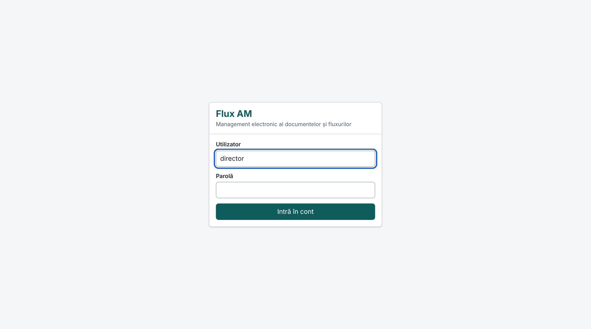<figcaption>Figura 1. Ecranul de autentificare. Pentru demonstrație parola tuturor utilizatorilor este <code>Demo-parola-2026</code>.</figcaption></figure>

Autentificarea se face cu utilizator și parolă. Opțional, se poate cere și un cod din aplicația de
autentificare pe telefon (2FA, secțiunea 12). Sesiunea expiră după 10 ore.

După autentificare, ecranul are trei zone, vizibile în toate capturile următoare:

- **bara de sus**: numele aplicației, căutarea globală („Caută dosare, beneficiari, facturi…”),
  numele utilizatorului cu numărul de notificări necitite și butonul „Ieșire”. Pentru director
  apare mențiunea „Vedere director: toate dosarele instituției”;
- **meniul din stânga**, grupat pe secțiuni (Lucru, Control și evidențe, Conducere, Administrare,
  Cont). Meniul arată numai ce are voie rolul respectiv: un expert EVF vede Panoul meu, Dosare,
  Dosar nou și Contul meu, iar directorul vede tot;
- **zona de lucru**.

## 3. Panoul meu, pe roluri

„Panoul meu” este pagina de pornire. Conține sarcinile utilizatorului grupate după termen
(depășit, azi, săptămâna aceasta, mai târziu), coada comună a rolului, documentele pe care trebuie
să le semneze și notificările.

### 3.1. Directorul

<figure>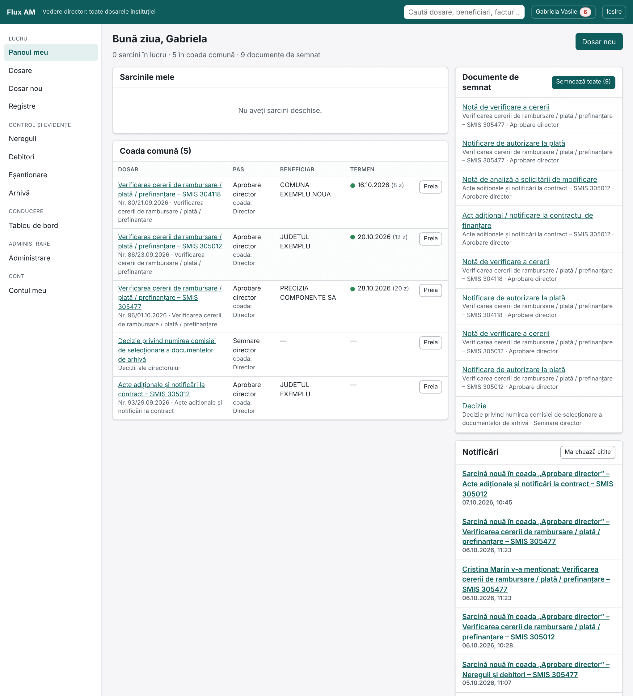<figcaption>Figura 2. Panoul directorului: 5 dosare în coada „Aprobare director” / „Semnare director”, 9 documente de semnat și notificările (sarcini noi, mențiuni ale colegilor).</figcaption></figure>

Directorul primește dosarele într-o **coadă comună**. Butonul „Preia” trece dosarul pe numele său.
Documentele de semnat apar în dreapta. Butonul **„Semnează toate (9)”** semnează în lot toate
notele și notificările care așteaptă semnătura sa. Semnarea în lot respectă aceleași reguli ca
semnarea individuală: ordinea semnatarilor, dreptul pe dosar și declarația de conflict de interese.

### 3.2. Expertul de verificare financiară (EVF)

<figure>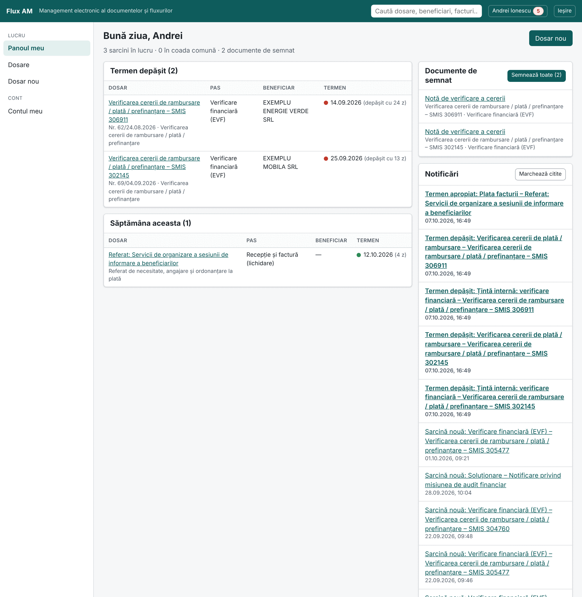<figcaption>Figura 3. Panoul expertului EVF: două dosare cu termen depășit (în roșu, cu numărul de zile de depășire), unul în săptămâna curentă și notificările de termen.</figcaption></figure>

Sarcinile cu termenul depășit apar primele. Notificările „Termen depășit” sunt trimise automat de
sistem la scanarea zilnică a termenelor, iar o copie ajunge la șeful de serviciu.

### 3.3. Șeful de serviciu

<figure>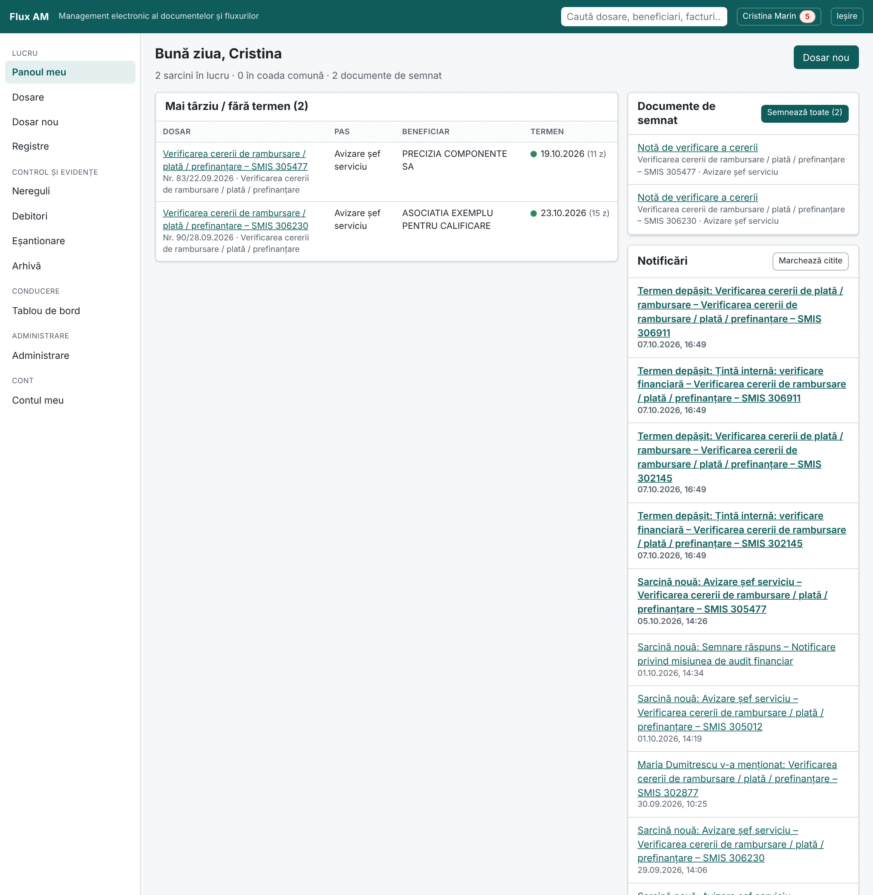<figcaption>Figura 4. Panoul șefului Serviciului Verificare Financiară: dosarele trimise de experți la avizare și notele de verificare de semnat.</figcaption></figure>

Șeful primește și notificările de depășire a termenelor experților din subordine.

### 3.4. Registratura și ofițerul de nereguli

<figure>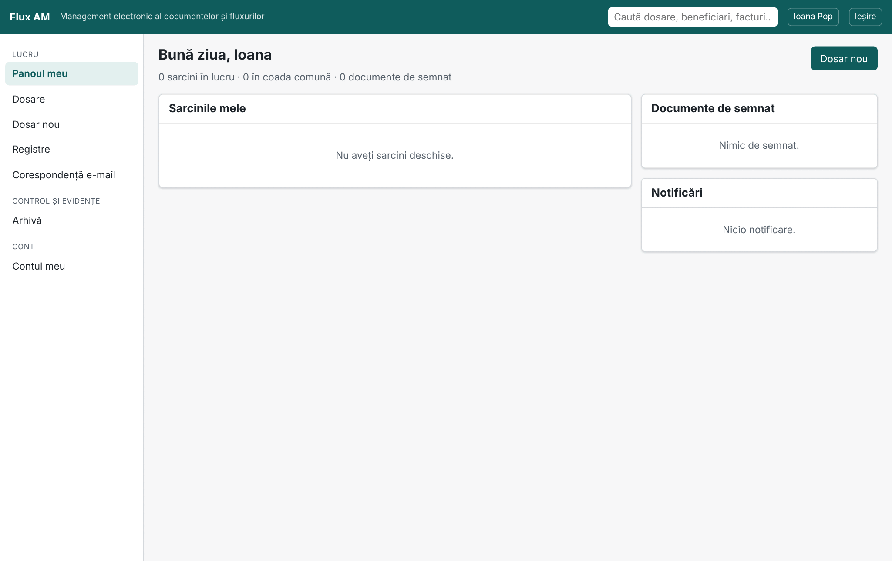<figcaption>Figura 5. Panoul registraturii. Toate dosarele înregistrate au fost deja repartizate, iar meniul conține „Corespondență e-mail” (secțiunea 7.4).</figcaption></figure>

<figure>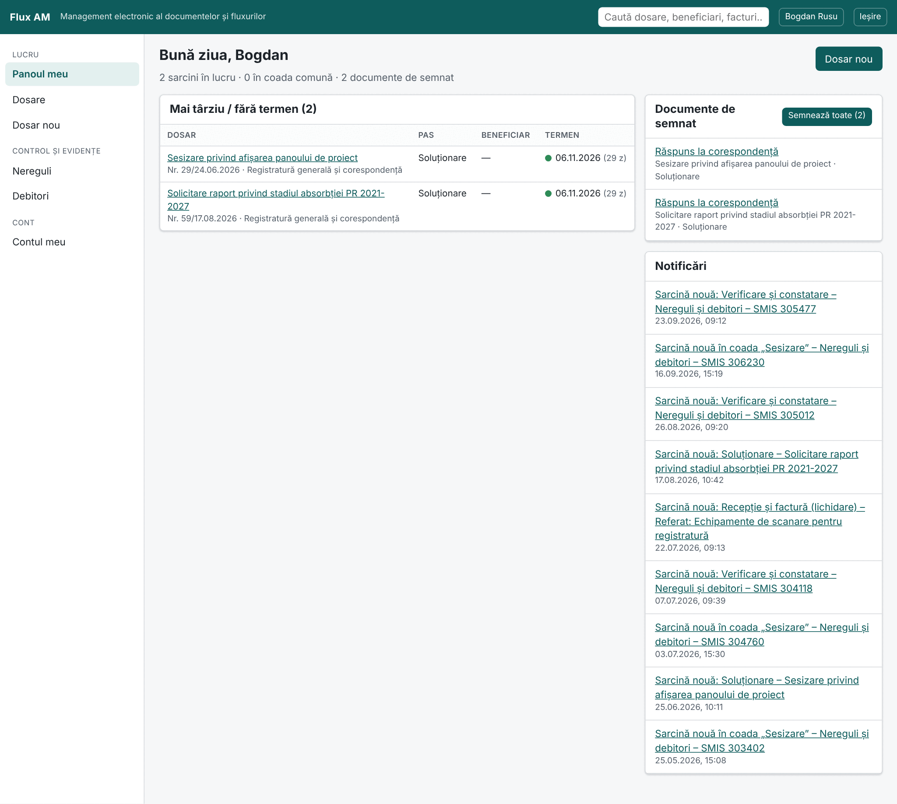<figcaption>Figura 6. Panoul ofițerului de nereguli: două solicitări de corespondență repartizate spre soluționare și notificările privind sesizările de nereguli primite.</figcaption></figure>

### 3.5. Pe telefon: aprobare și semnare din mers

Pe telefon, meniul se deschide din butonul ☰, iar jos rămâne o bară cu Panou (cu numărul
documentelor de semnat), Dosare, Tablou, Vizite și Meniu. Listele devin carduri. În dosar,
**documentele de semnat apar direct în „Sarcina mea”**, cu „Deschide” și „Semnează” lângă butonul
de aprobare, deci directorul nu mai trece prin fila Documente. Același bloc apare și pe calculator.

<figure>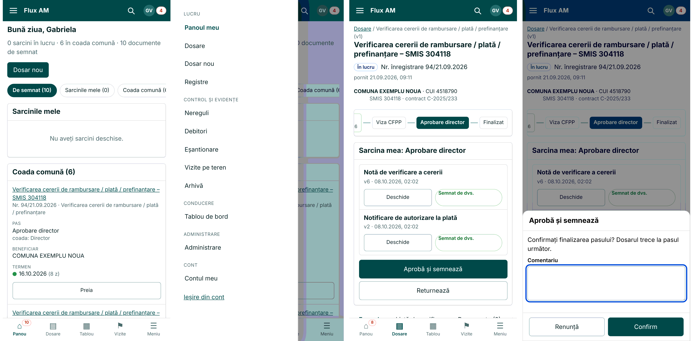<figcaption>Figura 7. Directorul pe telefon: panoul cu scurtăturile „De semnat”, „Sarcinile mele”, „Coada comună”, meniul lateral, dosarul cu documentele semnate direct din „Sarcina mea” și confirmarea aprobării.</figcaption></figure>

## 4. Lista dosarelor și dosarul nou

<figure>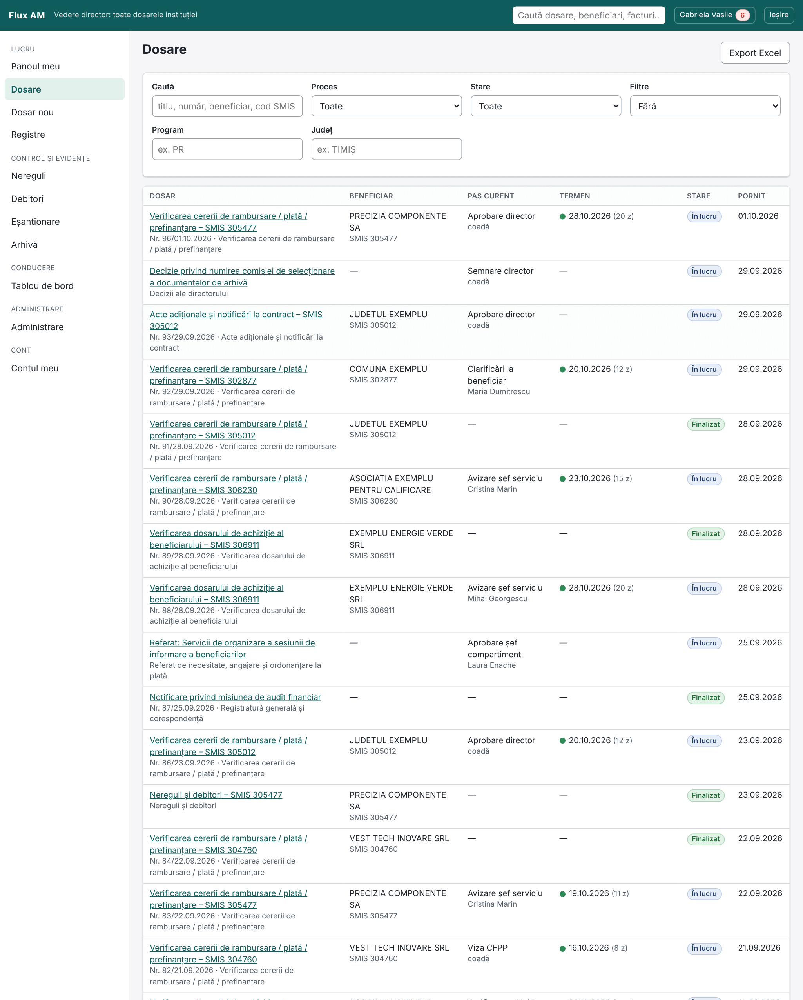<figcaption>Figura 8. Lista dosarelor, cu filtre după text, proces, stare, program, județ și termen. Pentru fiecare dosar se văd beneficiarul, pasul curent cu persoana sau coada, termenul și starea.</figcaption></figure>

Lista respectă drepturile de acces. Un expert vede doar dosarele la care a lucrat sau la care i
s-a dat acces. Directorul, administratorul funcțional și auditorul văd toate dosarele instituției.
Butonul „Export Excel” descarcă lista filtrată.

<figure>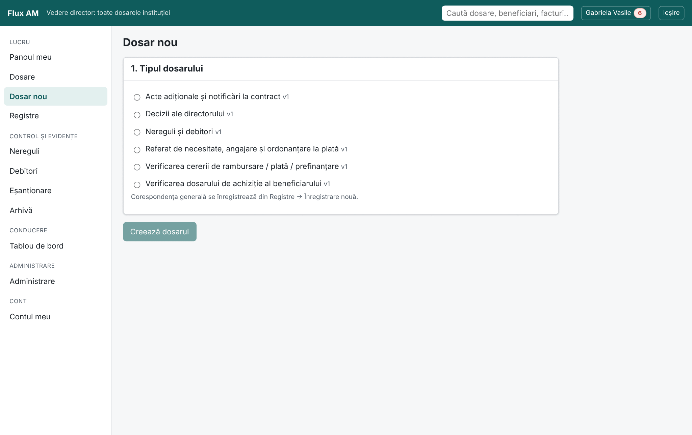<figcaption>Figura 9. Dosar nou: alegerea tipului de dosar. Pentru circuitele legate de un proiect se alege apoi proiectul, iar datele se precompletează.</figcaption></figure>

## 5. Dosarul pas cu pas: o cerere de rambursare (P1)

Exemplul este cererea de rambursare CR-6 pentru proiectul SMIS 302145 (Exemplu Mobila SRL),
înregistrată la 12.05.2026 și aprobată la 21.05.2026.

### 5.1. Antetul și bara circuitului

<figure><figcaption>Figura 10. Dosarul P1 finalizat, fila „Formular”: antetul (titlu, număr de înregistrare, beneficiar, CUI, cod SMIS, contract), bara circuitului cu persoana și data fiecărui pas și datele dosarului, cu proveniența fiecărei valori.</figcaption></figure>

- **Antetul** arată starea (În lucru / Finalizat), numărul de înregistrare și beneficiarul.
- **Bara circuitului** arată pașii. Cei parcurși apar în verde, cu numele și data, iar pasul curent
  e evidențiat. Pașii neaplicabili apar cu mențiunea „nu a fost cazul”. Aici: fără clarificări,
  fără verificare EI și fără viză CFPP, pentru că cererea de rambursare nu o cere.
- **Datele dosarului** sunt precompletate („Precompletat din proiect”, „din fișa beneficiarului”,
  „din dosarul anterior”). Tabelul **Cheltuieli solicitate** conține linia bugetară, documentul
  justificativ, CUI-ul furnizorului, numărul și data facturii, suma solicitată, eligibilă și
  neeligibilă. Totalurile se calculează exact, la ban.

### 5.2. Lucrul expertului: declarația de conflict de interese

<figure>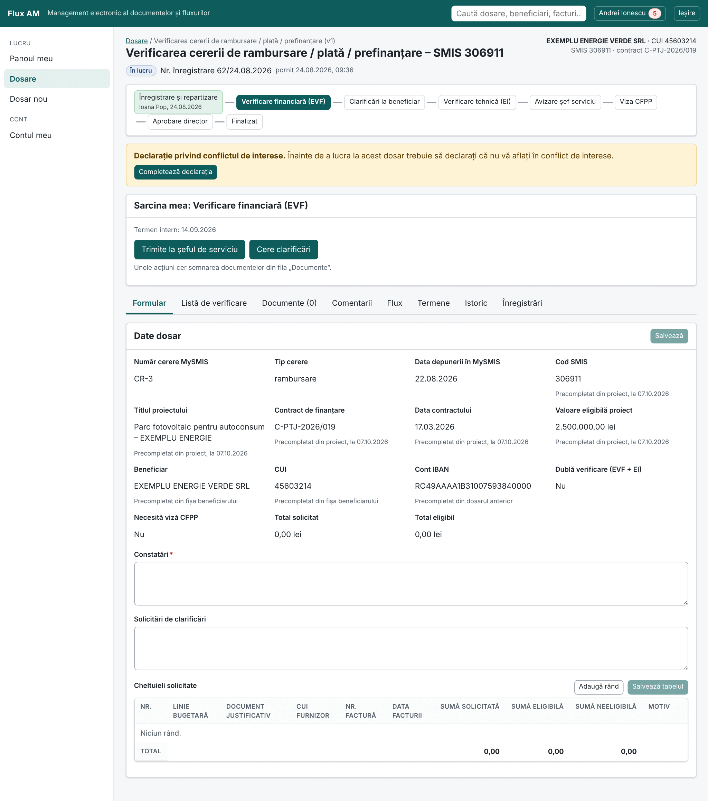<figcaption>Figura 11. Același tip de dosar deschis de expertul EVF, în lucru: avertismentul privind declarația de conflict de interese, sarcina curentă („Trimite la șeful de serviciu”, „Cere clarificări”) și formularul editabil, cu tabelul de cheltuieli gol.</figcaption></figure>

Pe pașii de verificare, înainte de orice acțiune, verificatorul semnează o declarație pe propria
răspundere. Fără ea, aplicația nu permite salvarea și nici trimiterea mai departe.

<figure>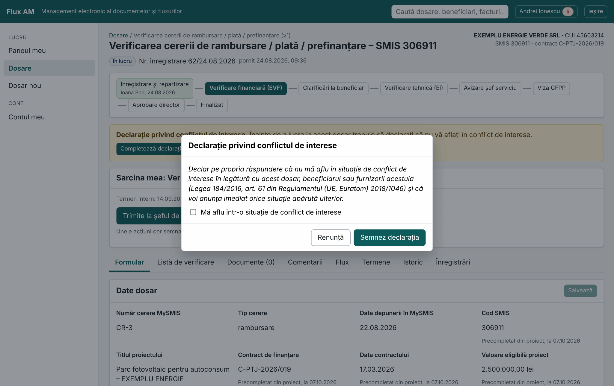<figcaption>Figura 12. Declarația privind conflictul de interese (Legea 184/2016, art. 61 din Regulamentul financiar). Dacă verificatorul bifează că se află în conflict, sarcina se retrage, iar șeful este anunțat pentru realocare.</figcaption></figure>

### 5.3. Clarificări: termenul se suspendă

<figure>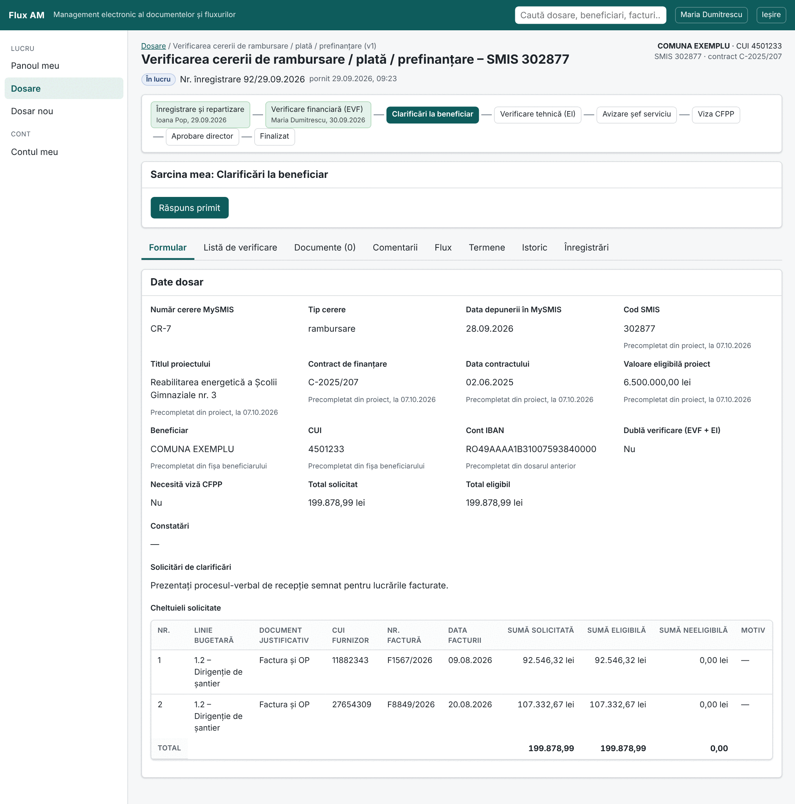<figcaption>Figura 13. Dosar la pasul „Clarificări la beneficiar”: scrisoarea de clarificări a fost generată și înregistrată, iar termenul de verificare este suspendat până la butonul „Răspuns primit”.</figcaption></figure>

### 5.4. Lista de verificare

<figure>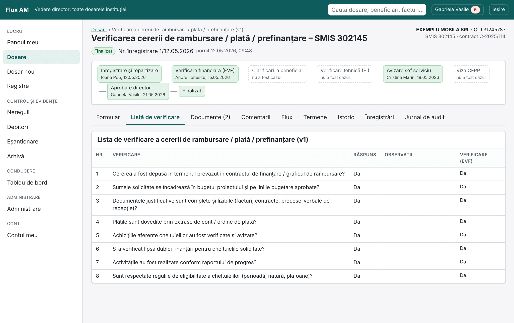<figcaption>Figura 14. Lista de verificare a cererii (8 puncte), cu răspunsul și observațiile verificatorului. Dacă s-a cerut dubla verificare, apare și coloana expertului EI.</figcaption></figure>

Trimiterea mai departe nu e posibilă cât timp lipsesc răspunsuri. Aplicația spune exact ce lipsește,
de exemplu „punctul 1 nu are răspuns” sau „Semnați documentul”.

### 5.5. Documente și semnături

<figure>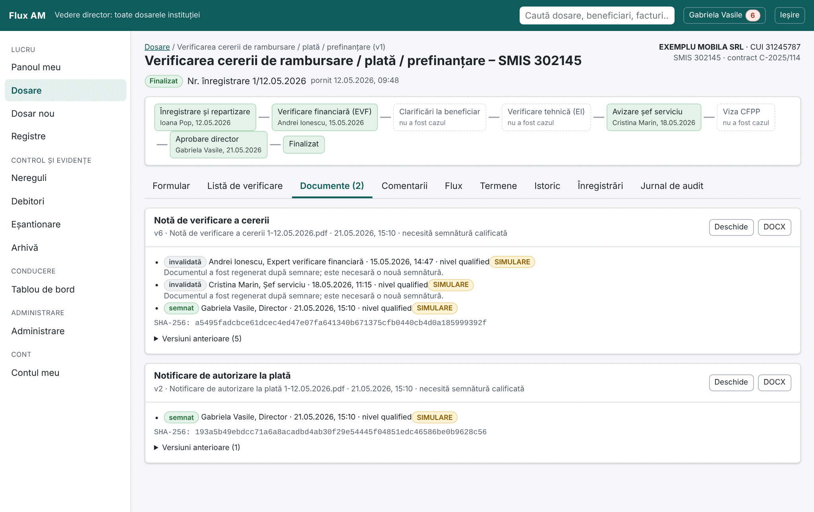<figcaption>Figura 15. Documentele dosarului: nota de verificare (versiunea 6) și notificarea de autorizare la plată. Sub fiecare se văd semnăturile cu persoana, momentul și nivelul, plus amprenta SHA-256 a PDF-ului.</figcaption></figure>

Când un document se regenerează după semnare (de exemplu, șeful adaugă o observație), semnăturile
anterioare devin **invalidate**, cu motivul afișat, și trebuie date din nou. La fel se întâmplă la
o returnare. Toate versiunile se păstrează („Versiuni anterioare”). În demonstrație semnătura este
simulată și PDF-ul primește ștampila „SIMULARE”. În producție se folosește furnizorul de semnătură
calificată ales de instituție.

### 5.6. Înregistrări, termene, istoric

<figure>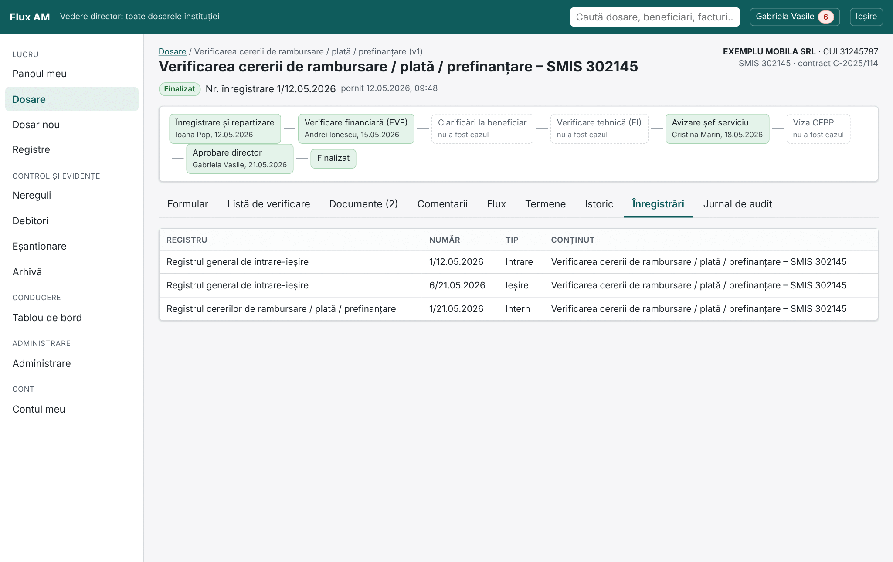<figcaption>Figura 16. Înregistrările dosarului: intrarea în registrul general (1/12.05.2026), ieșirea notificării (6/21.05.2026) și înregistrarea în Registrul cererilor de rambursare (1/21.05.2026). Toate au fost alocate automat de circuit.</figcaption></figure>

<figure>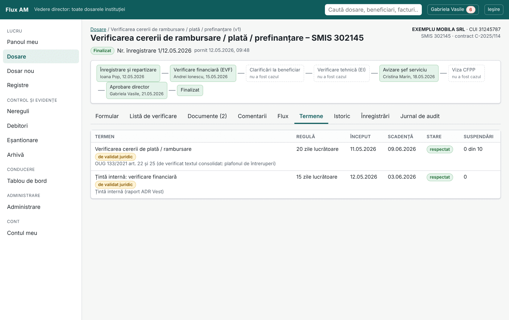<figcaption>Figura 17. Termenele dosarului: termenul legal de 20 de zile lucrătoare (OUG 133/2021) și ținta internă de 15 zile, ambele respectate. Mențiunea „de validat juridic” rămâne până la confirmarea consilierului juridic.</figcaption></figure>

<figure>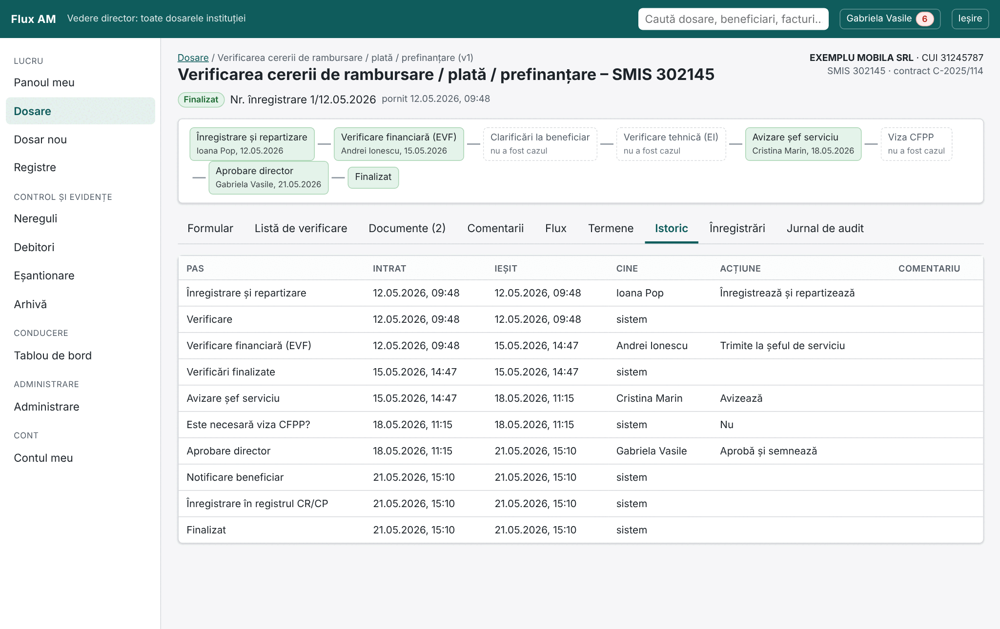<figcaption>Figura 18. Istoricul pașilor: intrarea și ieșirea din fiecare pas, cine a acționat și ce cale a ales. Pașii automați (ramificare, decizia „Este necesară viza CFPP?”, notificarea, înregistrarea) apar cu „sistem”.</figcaption></figure>

### 5.7. Diagrama circuitului

<figure>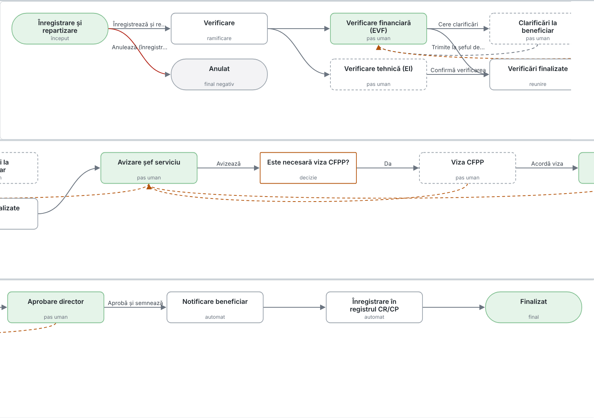<figcaption>Figura 19. Fila „Flux”: diagrama circuitului P1 desenată din definiția procesului. În verde apar pașii parcurși. Liniile portocalii întrerupte sunt returnările posibile, iar linia gri întreruptă e revenirea din clarificări la verificare. Verificarea EVF și verificarea EI rulează în paralel și se reunesc înainte de avizarea șefului.</figcaption></figure>

### 5.8. Jurnalul de audit al dosarului

<figure>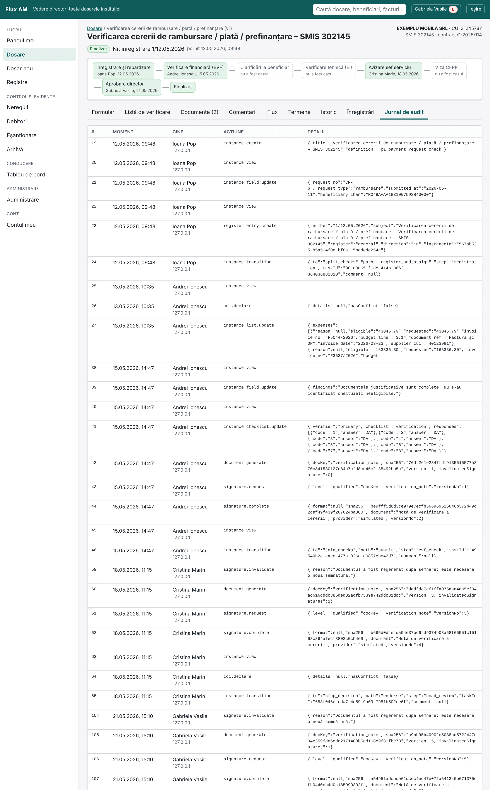<figcaption>Figura 20. Jurnalul de audit al dosarului (vizibil auditorului, administratorului și directorului): fiecare vizualizare, salvare, declarație, generare de document, semnătură și tranziție, cu persoana, momentul, adresa IP și valorile modificate.</figcaption></figure>

### 5.9. Comentarii și mențiuni

<figure>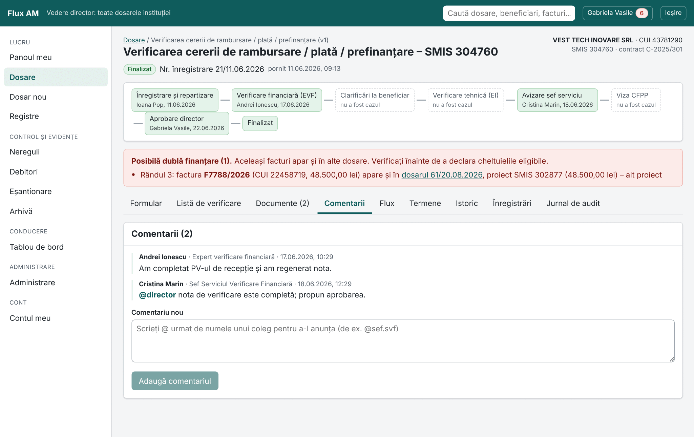<figcaption>Figura 21. Comentariile unui dosar: expertul anunță că a regenerat nota, iar șefa de serviciu îl menționează pe @director. Cel menționat primește notificare și drept de citire pe dosar.</figcaption></figure>

### 5.10. Alerta de dublă finanțare

<figure>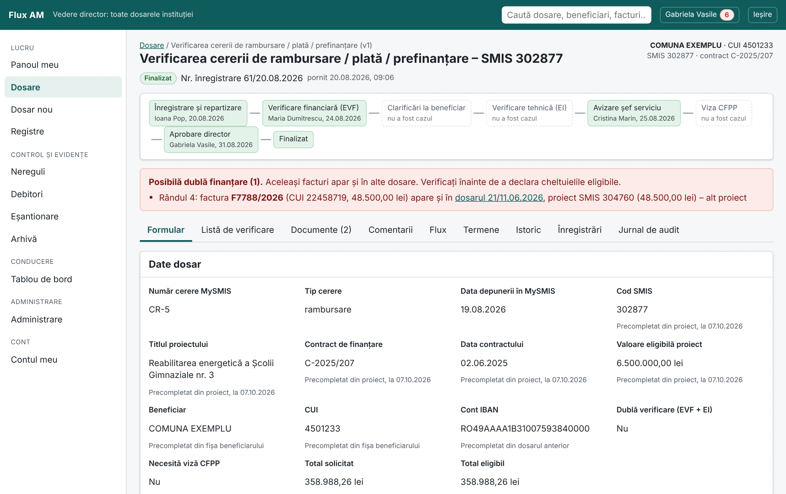<figcaption>Figura 22. Alertă de posibilă dublă finanțare: factura F7788/2026 (CUI 22458719, 48.500,00 lei) apare și într-o cerere a altui proiect. Alerta are link spre celălalt dosar.</figcaption></figure>

Fiecare factură din tabelul de cheltuieli (CUI furnizor + număr normalizat, fără spații, prefixe și
zerouri) este comparată cu toate celelalte dosare, din orice proiect sau program.

## 6. Celelalte circuite (P2–P7)

### 6.1. P2 – Verificarea dosarului de achiziție

<figure>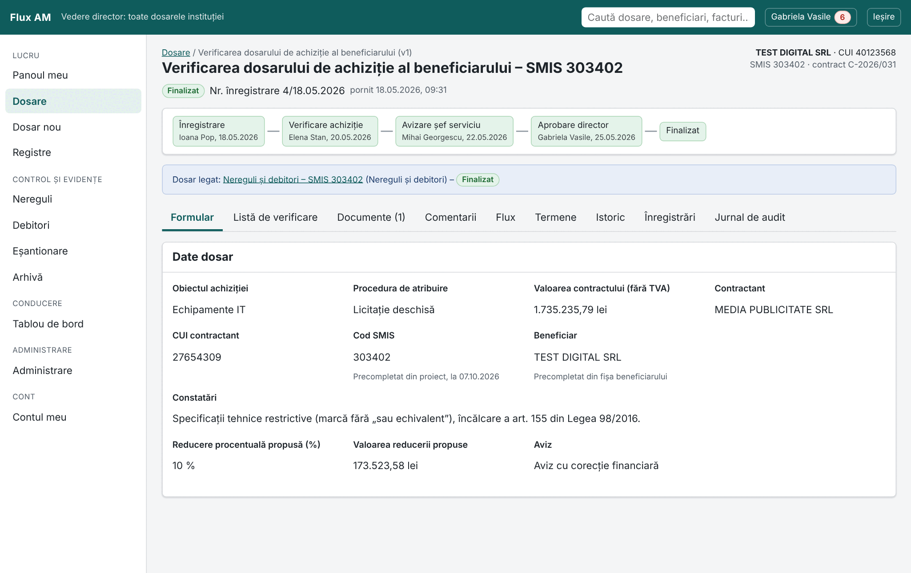<figcaption>Figura 23. Verificarea achiziției pentru proiectul SMIS 303402: s-au constatat specificații tehnice restrictive (încălcarea art. 155 din Legea 98/2016) și s-a propus o corecție de 10% (173.523,58 lei). Verdictul „aviz cu corecție financiară” a deschis automat dosarul de nereguli legat (banda albastră).</figcaption></figure>

### 6.2. P3 – Acte adiționale și notificări

<figure>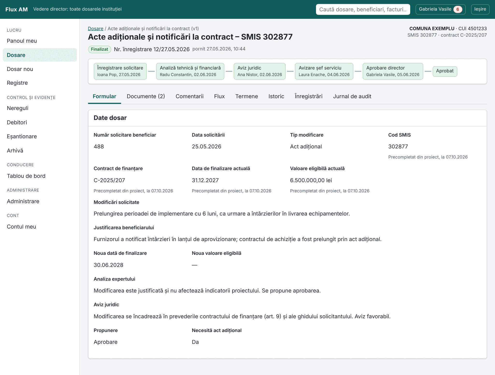<figcaption>Figura 24. Solicitare de prelungire cu 6 luni a perioadei de implementare: analiza expertului, avizul juridic (doar pentru act adițional) și aprobarea. După aprobare, data de finalizare din contract s-a actualizat automat la 30.06.2028.</figcaption></figure>

<figure>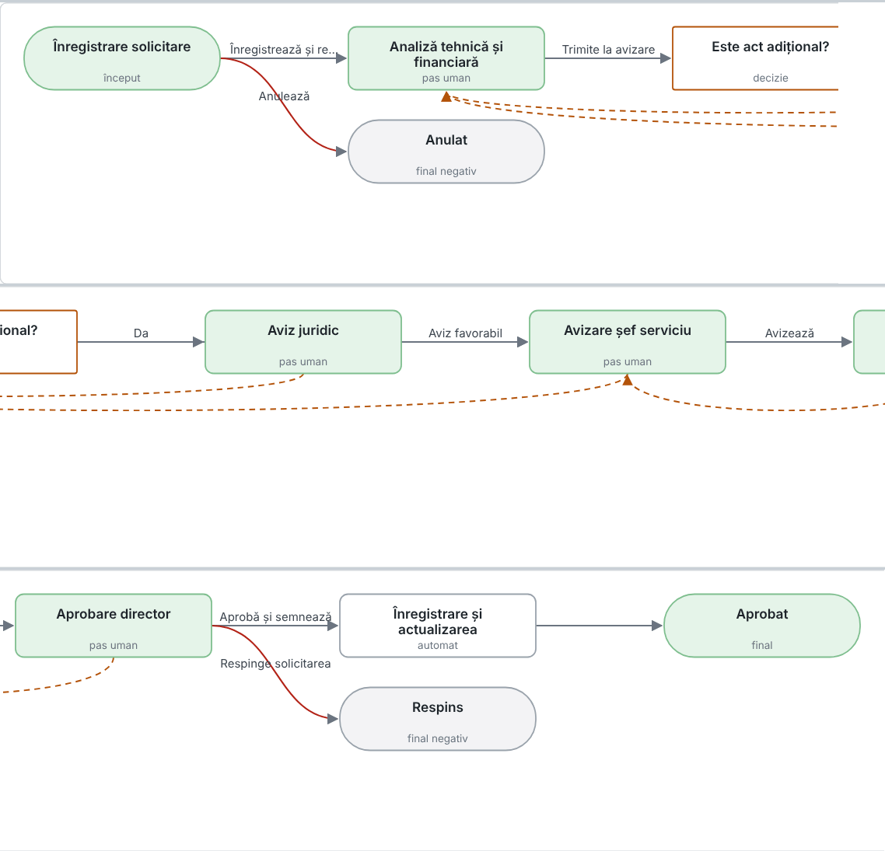<figcaption>Figura 25. Circuitul P3: decizia automată „Este act adițional?” trimite dosarul la avizul juridic sau direct la șef.</figcaption></figure>

### 6.3. P4 – Nereguli și debitori

<figure>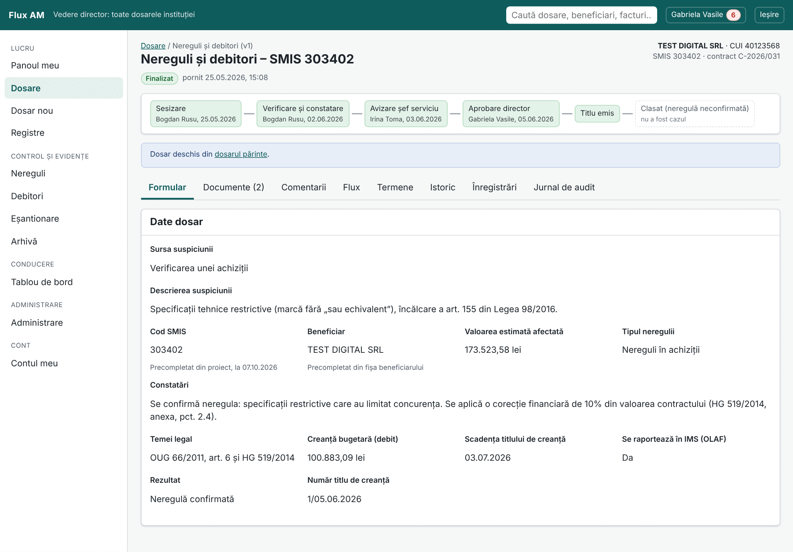<figcaption>Figura 26. Dosarul de nereguli deschis automat din P2: sursa și descrierea suspiciunii sunt preluate din verificarea achiziției. Ofițerul de nereguli a constatat neregula și a stabilit creanța de 100.883,09 lei (OUG 66/2011), cu scadență și raportare în IMS. Directorul a aprobat emiterea titlului de creanță 1/05.06.2026.</figcaption></figure>

<figure>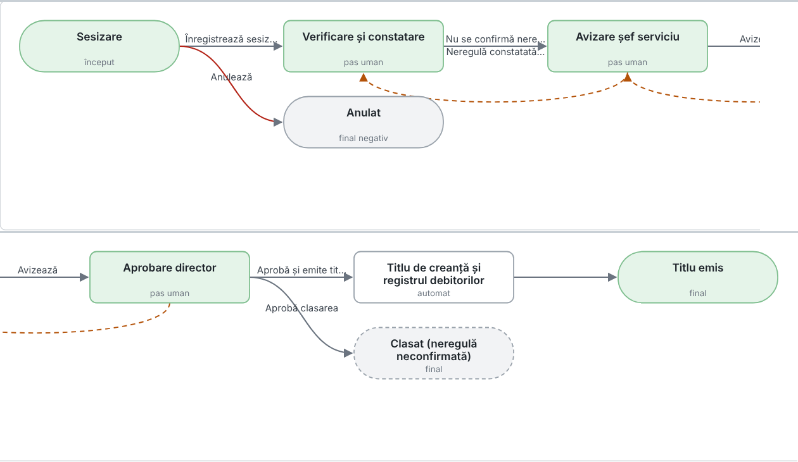<figcaption>Figura 27. Circuitul P4: neregula se confirmă (titlu de creanță și registrul debitorilor) sau se clasează.</figcaption></figure>

### 6.4. P5 – Corespondență și petiții

<figure>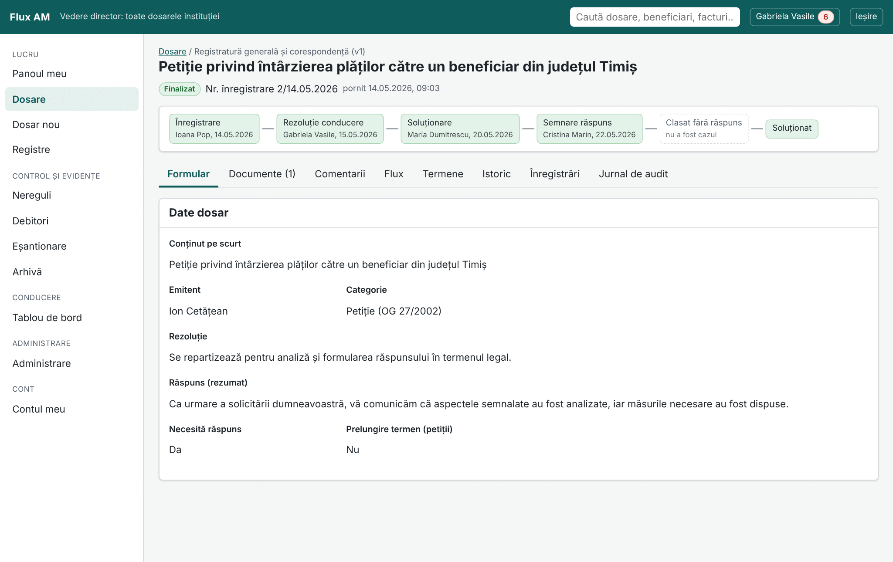<figcaption>Figura 28. Petiție (OG 27/2002): înregistrare, rezoluția directorului cu repartizarea, soluționarea, semnarea răspunsului și ieșirea. Termenul de 30 de zile se calculează automat.</figcaption></figure>

### 6.5. P6 – Referat de necesitate, angajare și plată

<figure>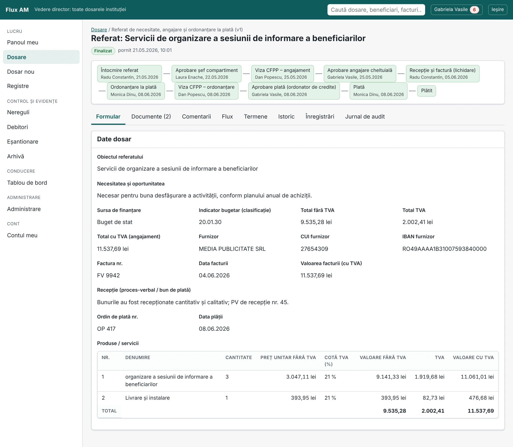<figcaption>Figura 29. Referat pentru servicii de organizare a unei sesiuni de informare: produsele cu cantitate, preț și cota TVA, cu TVA-ul calculat exact (9.535,28 + 2.002,41 = 11.537,69 lei). Circuitul a trecut prin vizele CFPP de angajament și de ordonanțare, factură, recepție și ordinul de plată OP 417.</figcaption></figure>

<figure>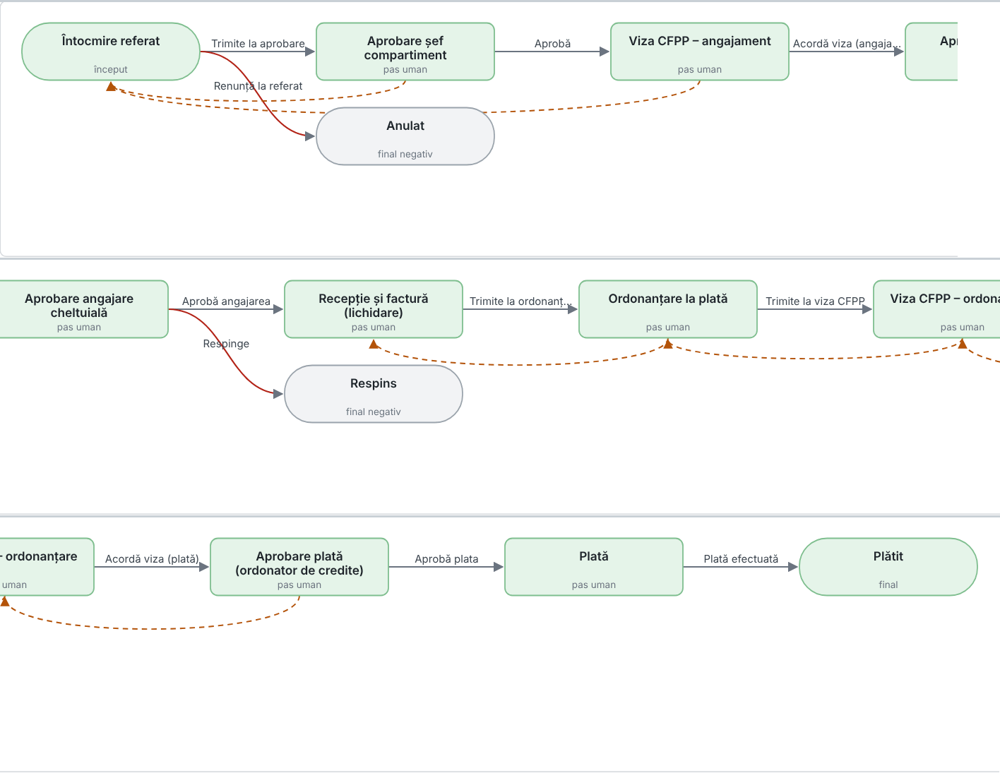<figcaption>Figura 30. Circuitul P6, cu cele două vize CFPP (angajament și ordonanțare) și cele două aprobări ale ordonatorului de credite.</figcaption></figure>

Reguli verificate de aplicație: factura nu poate depăși angajamentul, iar persoana care întocmește
referatul nu poate acorda viza CFPP.

### 6.6. P7 – Decizii ale directorului

<figure><figcaption>Figura 31. Decizie privind constituirea comisiei de evaluare: proiect, aviz șef compartiment, aviz de legalitate, semnare și comunicare. Numărul deciziei se alocă înainte de semnare și se păstrează dacă decizia este returnată.</figcaption></figure>

## 7. Registre, căutare și corespondență

### 7.1. Registrele

<figure>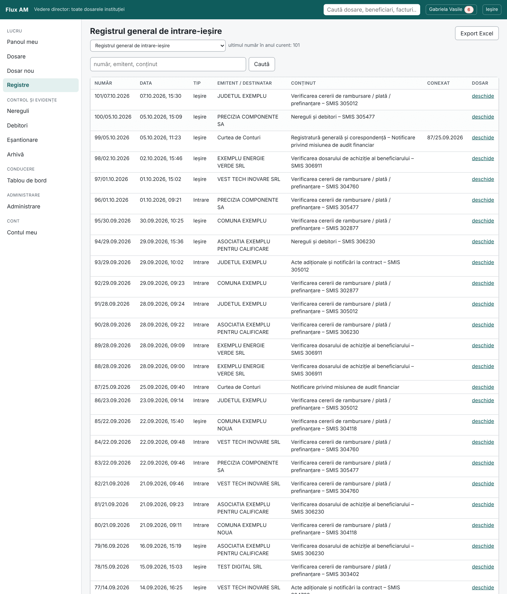<figcaption>Figura 32. Registrul general de intrare-ieșire: număr/dată, tip (intrare, ieșire, intern), emitent sau destinatar, conținut, înregistrarea conexată și dosarul. Ultimul număr în anul curent: 101.</figcaption></figure>

Numerele se alocă prin blocarea contorului registrului în aceeași tranzacție cu înregistrarea.
Astfel, numerele sunt consecutive și fără goluri chiar dacă mai multe persoane înregistrează simultan,
iar o operație anulată nu consumă număr. Fiecare registru se poate exporta în Excel.

<figure>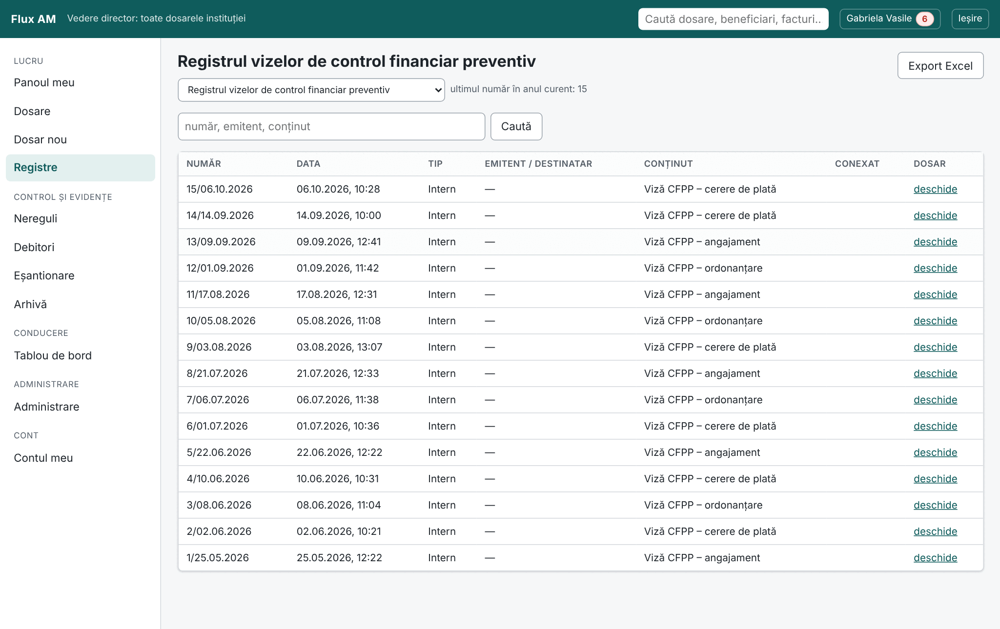<figcaption>Figura 33. Registrul vizelor de control financiar preventiv, completat automat de circuitele P1 și P6 (angajament, ordonanțare, cereri de plată).</figcaption></figure>

<figure>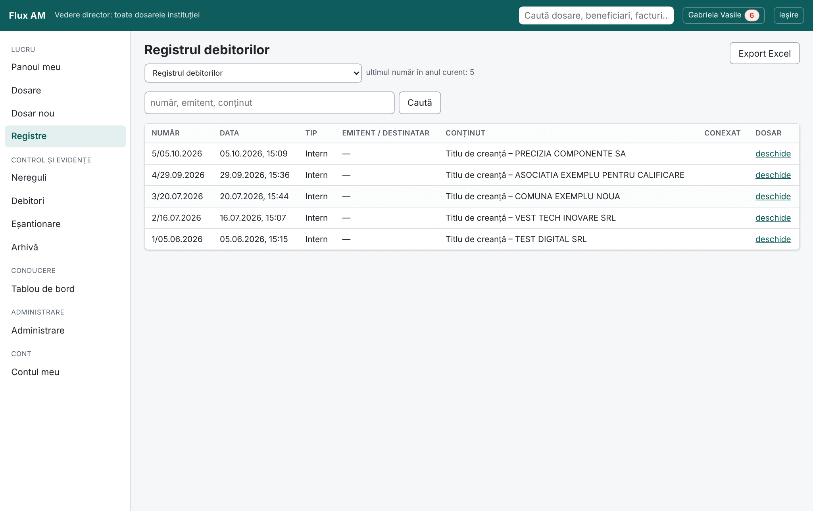<figcaption>Figura 34. Registrul debitorilor: titlurile de creanță emise de circuitul P4.</figcaption></figure>

### 7.2. Căutarea globală

<figure>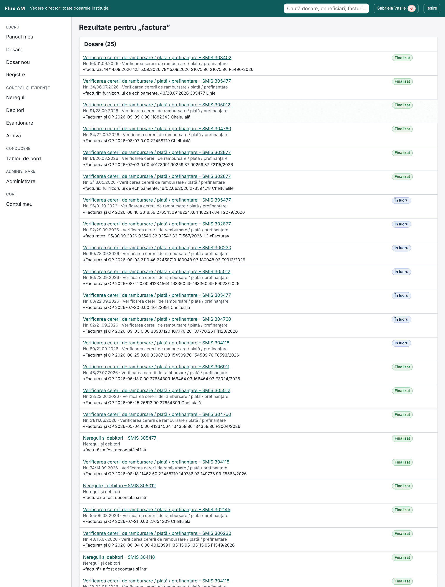<figcaption>Figura 35. Rezultatele căutării „factura”: 25 de dosare. Se caută în titlu, număr, beneficiar, proiect, valorile câmpurilor, tabelele de cheltuieli, comentarii și titlurile documentelor, fără diacritice obligatorii. Fragmentul găsit apare sub fiecare rezultat.</figcaption></figure>

### 7.3. Corespondența electronică

<figure>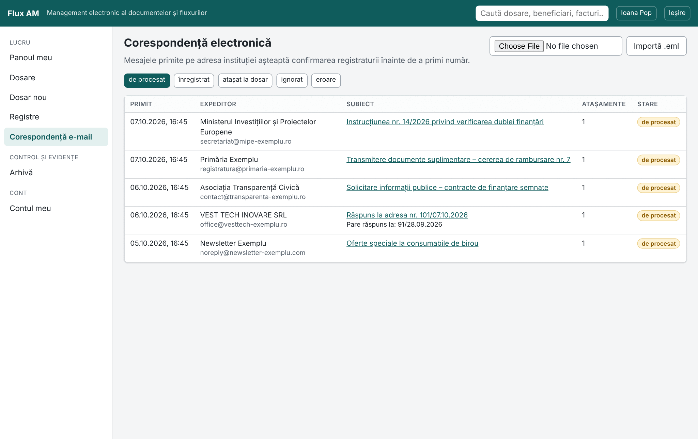<figcaption>Figura 36. Coada de e-mail a registraturii: mesajele primite pe adresa instituției așteaptă confirmarea înainte de a primi număr. Pentru mesajul care conține în subiect un număr de înregistrare existent, aplicația sugerează dosarul.</figcaption></figure>

<figure>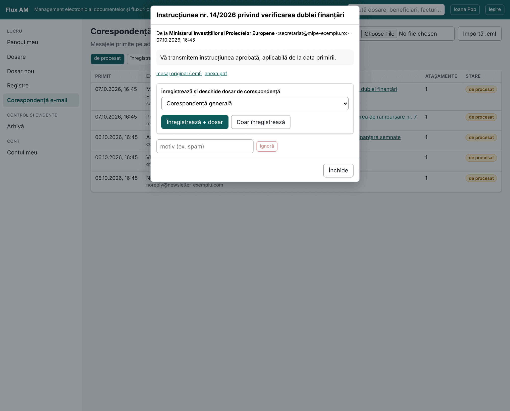<figcaption>Figura 37. Un mesaj deschis: expeditorul, textul, mesajul original (.eml) și anexa, păstrate cu amprentă SHA-256. Registratura îl poate înregistra și deschide un dosar de corespondență, doar înregistra, atașa la un dosar existent sau ignora cu motiv.</figcaption></figure>

## 8. Control și evidențe

### 8.1. Nereguli și raportarea în IMS

<figure>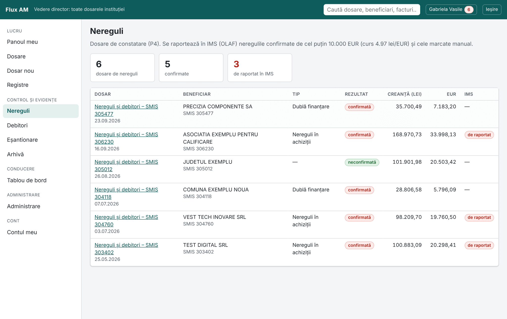<figcaption>Figura 38. Lista neregulilor: 6 dosare, 5 confirmate, 3 de raportat în IMS (OLAF). Pragul este de 10.000 EUR, la cursul configurat, iar o neregulă se poate marca și manual pentru raportare.</figcaption></figure>

### 8.2. Registrul debitorilor

<figure>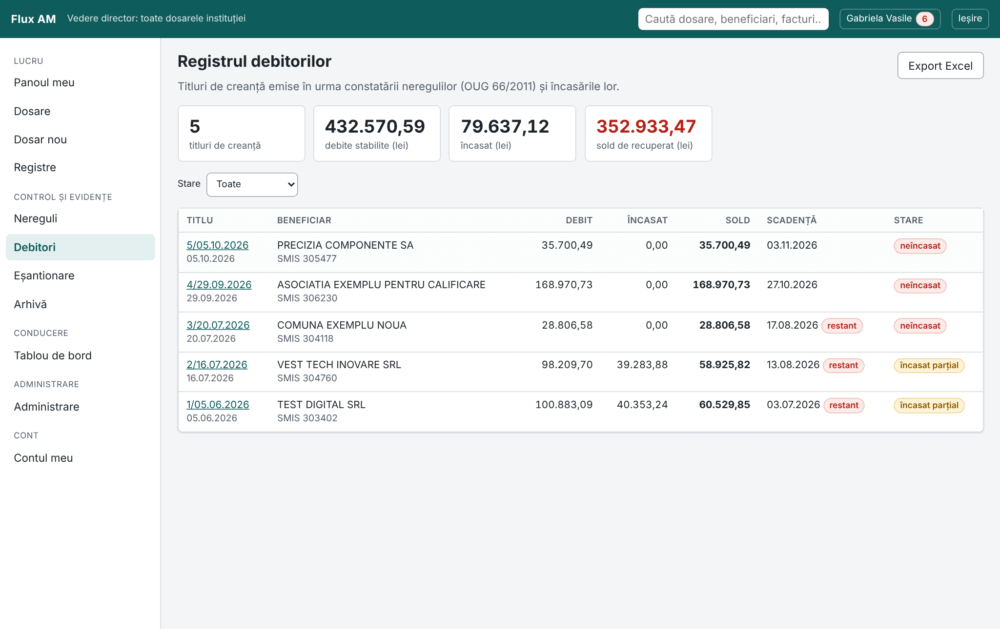<figcaption>Figura 39. Debitori: 5 titluri de creanță, 432.570,59 lei stabiliți, 79.637,12 lei încasați, 352.933,47 lei de recuperat. Pentru fiecare titlu se văd soldul, scadența, restanța și starea (neîncasat, încasat parțial).</figcaption></figure>

<figure>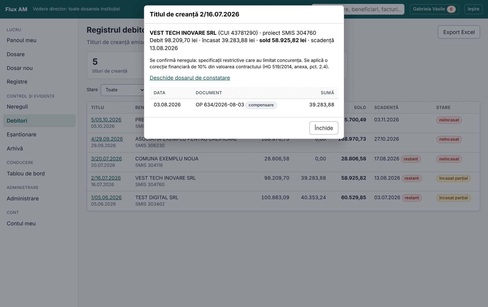<figcaption>Figura 40. Detaliul unui titlu de creanță: debit 98.209,70 lei, compensare de 39.283,88 lei prin OP 634, sold 58.925,82 lei, cu link spre dosarul de constatare.</figcaption></figure>

### 8.3. Eșantionarea pentru verificările la fața locului

<figure>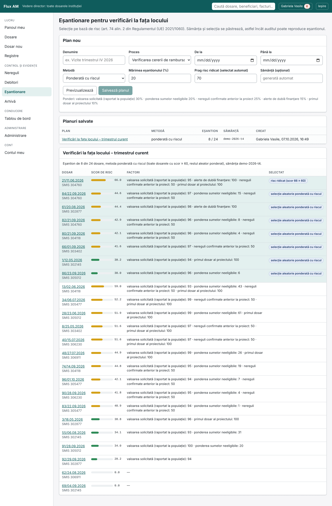<figcaption>Figura 41. Eșantionare pe bază de risc (art. 74 alin. 2 din Regulamentul (UE) 2021/1060): un plan nou se definește prin proces, perioadă, metodă, procent și prag. Planul salvat „Verificări la fața locului – trimestrul curent” a selectat 8 din 24 de dosare. Pentru fiecare dosar se văd scorul de risc, factorii și motivul selecției.</figcaption></figure>

Scorul de risc combină valoarea solicitată (30%), ponderea sumelor neeligibile (20%), neregulile
confirmate anterior la proiect (25%), alertele de dublă finanțare (15%) și primul dosar al
proiectului (10%). Dosarele peste prag intră automat, restul se aleg aleator ponderat. Sămânța
(„demo-2026-t4”) se păstrează, deci un auditor poate reproduce exact același eșantion.

### 8.4. Arhiva

<figure>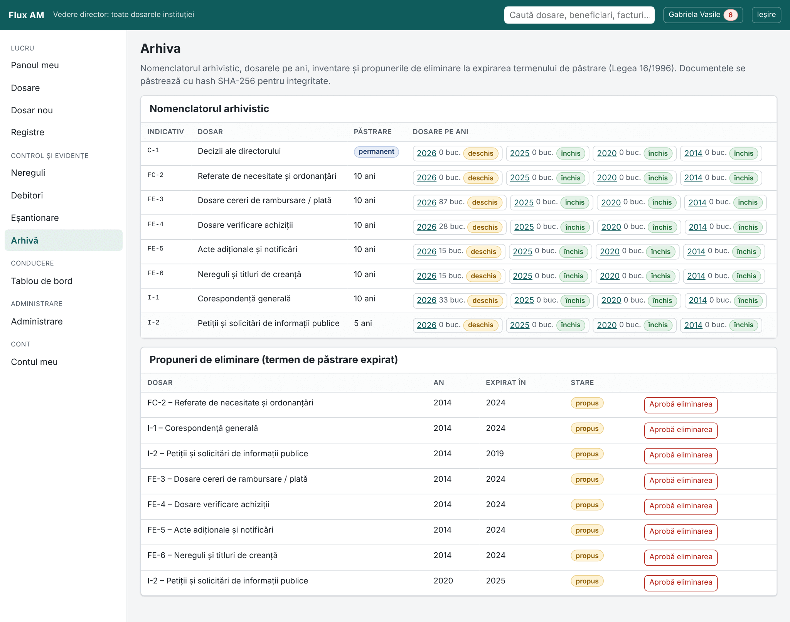<figcaption>Figura 42. Arhiva: nomenclatorul arhivistic (indicativ, termen de păstrare, dosare pe ani, deschise sau închise) și propunerile de eliminare pentru dosarele cu termenul de păstrare expirat, care se aprobă una câte una.</figcaption></figure>

Eliminarea cere decizia comisiei de selecționare și avizul Arhivelor Naționale (Legea 16/1996).

## 9. Vizite pe teren

Verificările la fața locului (art. 74 alin. 2 din Regulamentul (UE) 2021/1060) au un circuit
propriu, P8, și o pagină făcută pentru telefon sau tabletă, care funcționează și fără semnal.

### 9.1. De la eșantion la vizite programate

În planul de eșantionare salvat, șeful de serviciu sau directorul apasă **„Programează vizitele”**.
Pentru fiecare dosar selectat se deschide un dosar de verificare la fața locului, cu proiectul,
beneficiarul, motivul („Eșantion – risc ridicat” sau „Eșantion – selecție aleatorie”) și cererea
verificată deja completate. Coloana „Vizită” arată stadiul fiecăreia. O vizită se poate deschide și
la cerere, din Dosar nou.

<figure>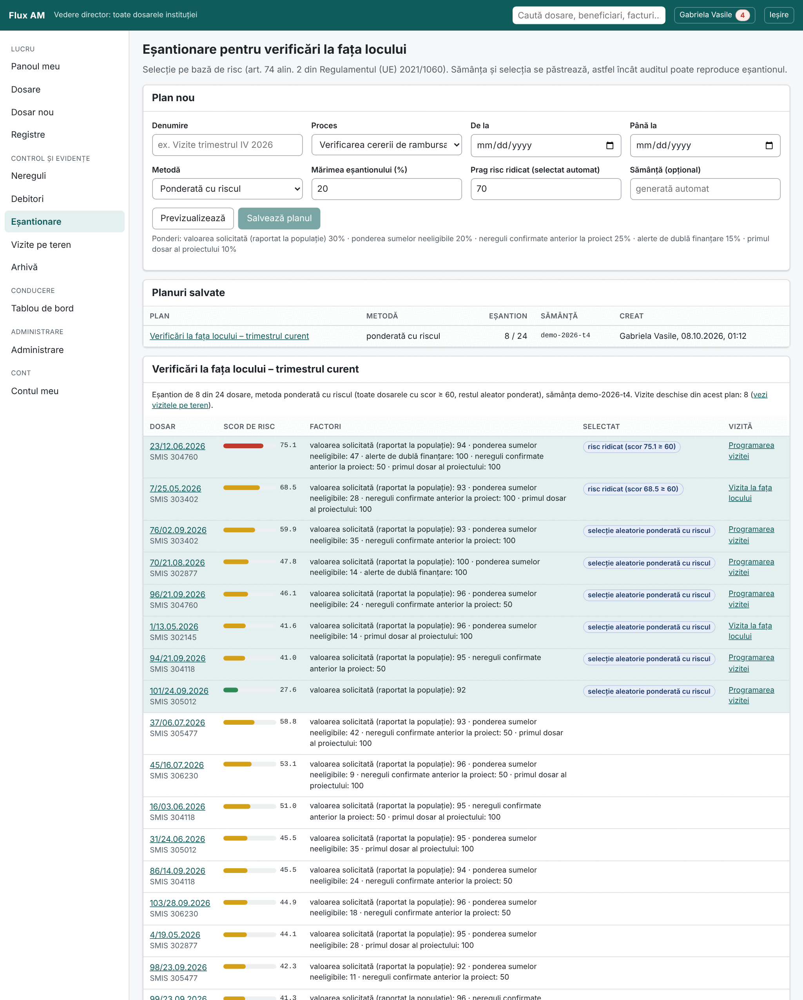<figcaption>Figura 43. Planul de eșantionare cu vizitele deschise: fiecare dosar selectat are acum o vizită, cu stadiul ei („Programarea vizitei”, „Vizita la fața locului” etc.).</figcaption></figure>

La programare se completează data, adresa locului de implementare și persoana de contact. Cu
„Programează și notifică beneficiarul”, aplicația generează notificarea, o înregistrează la ieșire,
o trimite pe e-mail și alocă numărul din Registrul verificărilor la fața locului.

### 9.2. Lista vizitelor

<figure>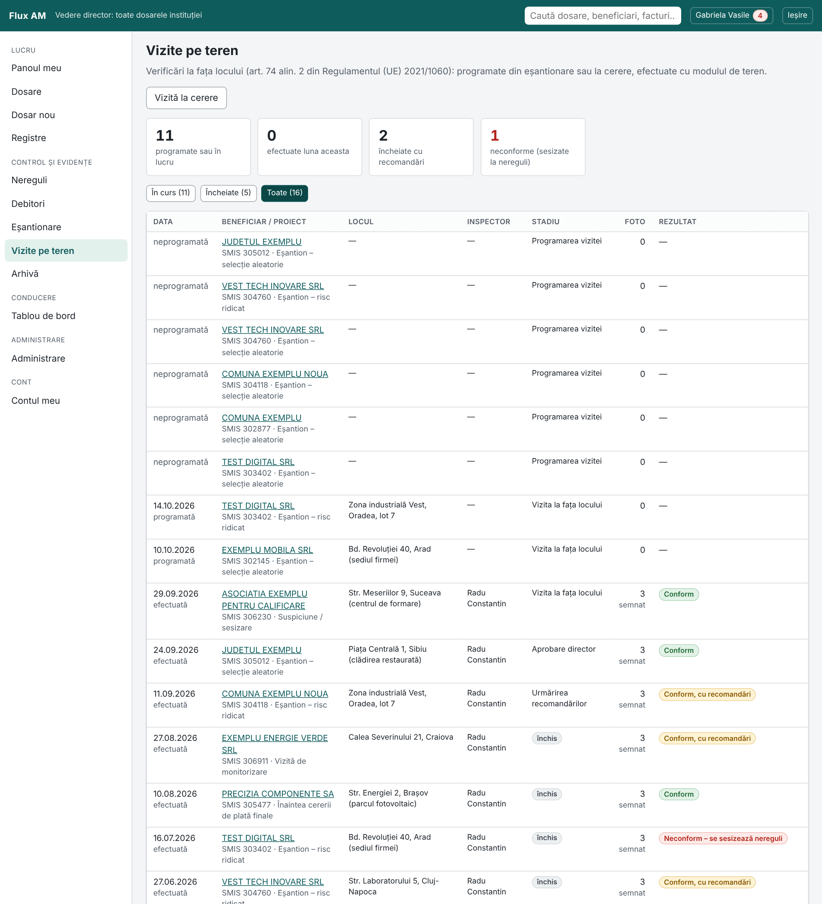<figcaption>Figura 44. Vizite pe teren: data programată sau efectuată, beneficiarul, locul, inspectorul, stadiul, numărul de fotografii, semnătura și rezultatul, cu indicatori pentru vizitele în curs, efectuate luna aceasta, cu recomandări și neconforme. Expertul vede butonul „Pe teren” la vizitele sale.</figcaption></figure>

### 9.3. Pe telefon, la beneficiar

Expertul deschide vizita de pe telefon (Vizite pe teren → „Pe teren”, sau butonul „Deschide modul
de teren” din dosar). Pagina se poate adăuga pe ecranul telefonului, ca o aplicație.

<figure>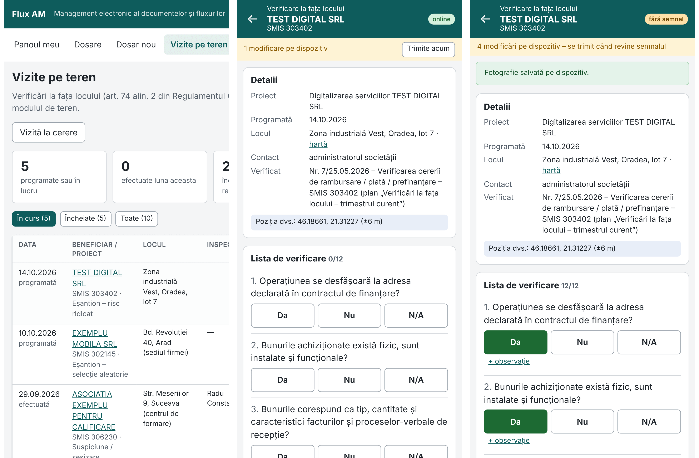<figcaption>Figura 45. Pe telefon: lista vizitelor; declarația privind conflictul de interese și preluarea vizitei; apoi lucrul fără semnal (eticheta „fără semnal”, modificările rămân pe dispozitiv și se trimit când revine semnalul).</figcaption></figure>

Ce face expertul la fața locului:

- **lista de verificare** (12 puncte), cu butoane mari Da / Nu / N/A; observația devine
  obligatorie unde lista o cere (de exemplu la un „Nu”);
- **fotografii** direct din cameră sau din galerie, cu o descriere. Fiecare fotografie primește
  ora și **poziția GPS** a telefonului și este micșorată pe dispozitiv, ca să se trimită repede;
- **constatările**, rezultatul (conform / conform cu recomandări / neconform), recomandările și
  termenul lor;
- **semnătura reprezentantului beneficiarului**, desenată pe ecran cu degetul, cu numele lui.

<figure>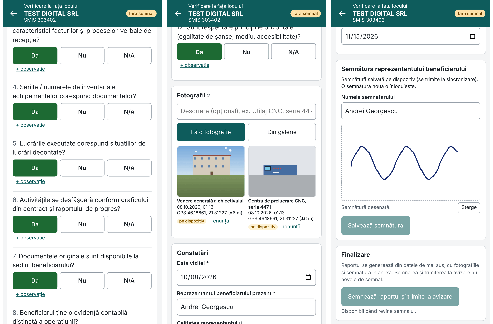<figcaption>Figura 46. Lista de verificare completată (punctul 9 cu „Nu” și observație), fotografiile cu ora și coordonatele GPS (marcate „pe dispozitiv” până la trimitere) și semnătura reprezentantului.</figcaption></figure>

**Fără semnal:** totul se salvează pe telefon. Pagina se redeschide și fără semnal, cu toate
datele introduse. Când revine semnalul, modificările se trimit singure, în ordine. Dacă serverul
refuză o modificare, aceasta rămâne afișată cu motivul și poate fi reîncercată sau abandonată.

<figure>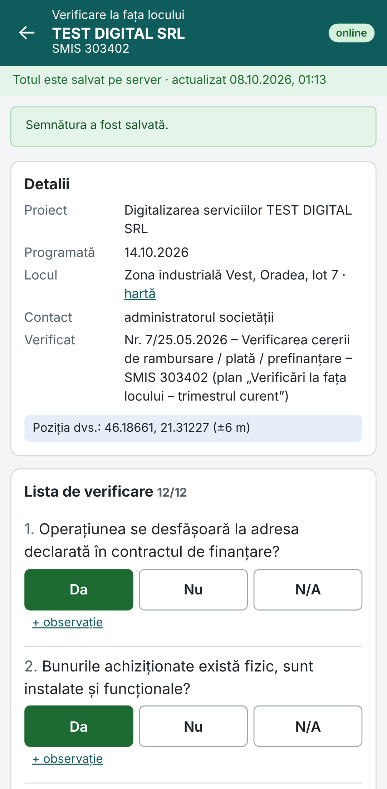<figcaption>Figura 47. Semnalul a revenit: „Totul este salvat pe server”. Butonul „Semnează raportul și trimite la avizare” generează raportul, îl semnează și îl trimite șefului de serviciu.</figcaption></figure>

Raportul nu poate fi trimis fără cel puțin o fotografie, fără semnătura reprezentantului, cu lista
de verificare incompletă sau fără recomandări și termen, atunci când rezultatul nu este „conform”.

### 9.4. Raportul, cu fotografiile în anexă

<figure>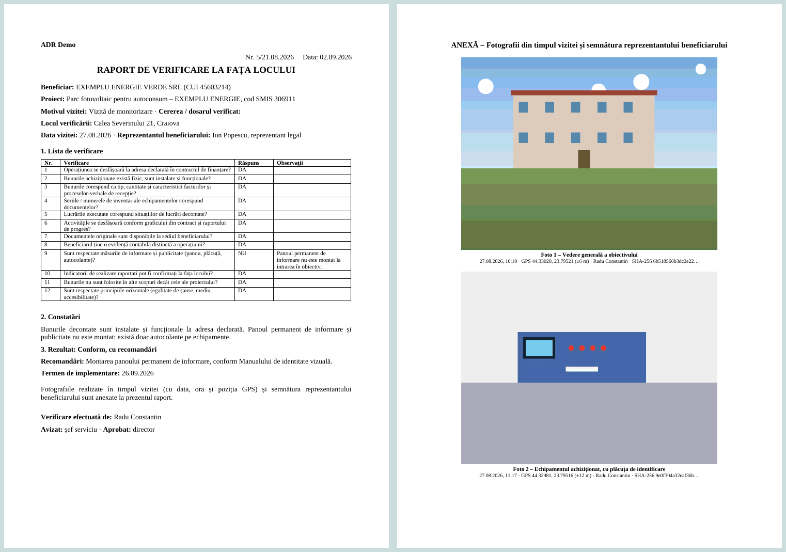<figcaption>Figura 48. Raportul de verificare la fața locului generat de aplicație (prima pagină și prima pagină a anexei): datele vizitei, lista de verificare, constatările, rezultatul și recomandările; în anexă fiecare fotografie cu data, ora, coordonatele GPS, autorul și amprenta, apoi semnătura reprezentantului.</figcaption></figure>

### 9.5. În dosar: fotografii, semnătură, rezultat

<figure>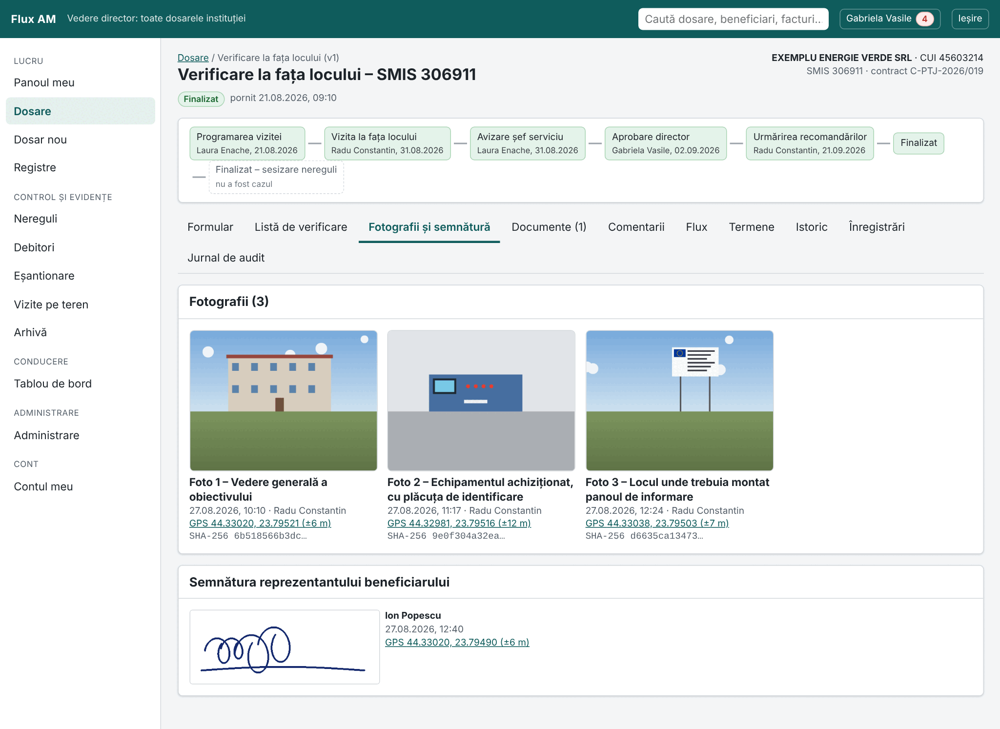<figcaption>Figura 49. Fila „Fotografii și semnătură” a unei vizite încheiate cu recomandări: fotografiile se măresc la clic, iar fiecare poziție GPS se deschide pe hartă. Bara circuitului arată și urmărirea recomandărilor.</figcaption></figure>

<figure>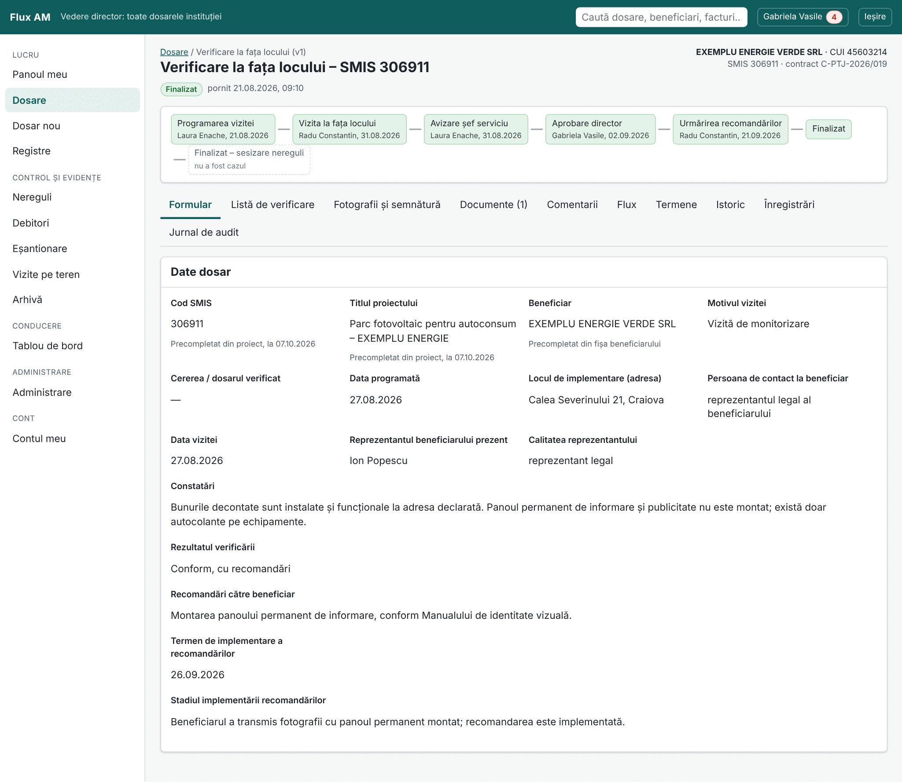<figcaption>Figura 50. Datele vizitei: motivul, cererea verificată, locul, data, reprezentantul, constatările, rezultatul, recomandările cu termen și stadiul implementării lor.</figcaption></figure>

După aprobarea directorului, raportul se înregistrează la ieșire și se trimite beneficiarului.
Mai departe, circuitul depinde de rezultat:

- **conform**: dosarul se închide;
- **conform, cu recomandări**: expertul urmărește implementarea până la termen. Dacă recomandările
  nu sunt implementate, poate sesiza neregula din același pas;
- **neconform**: se deschide automat un dosar de nereguli (P4), precompletat cu sursa „vizită la
  fața locului” și cu constatările.

<figure>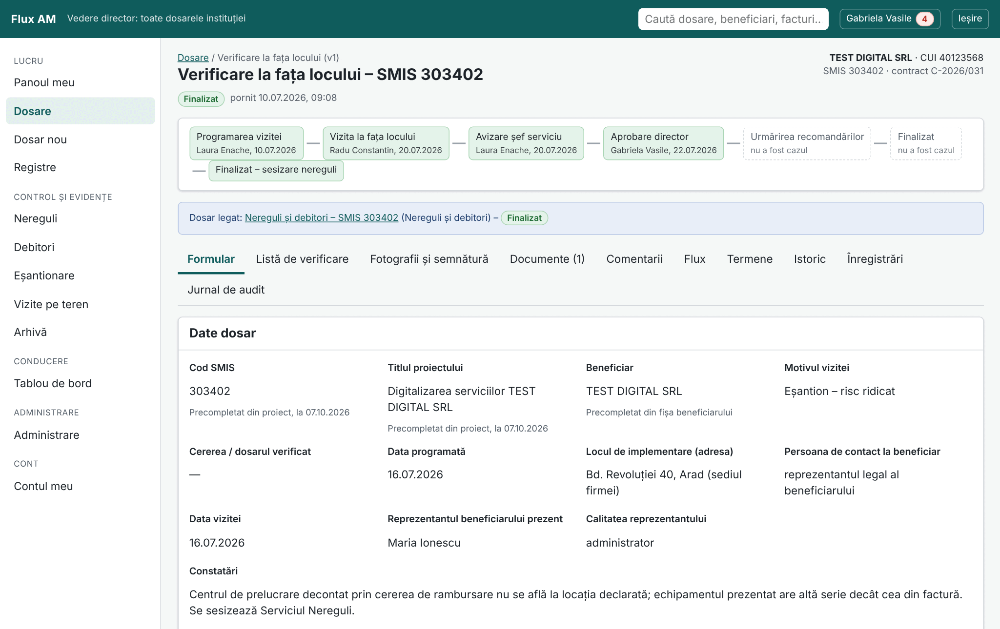<figcaption>Figura 51. O vizită neconformă: bara circuitului se încheie cu „Finalizat – sesizare nereguli”, iar banda albastră duce la dosarul de nereguli deschis automat.</figcaption></figure>

<figure>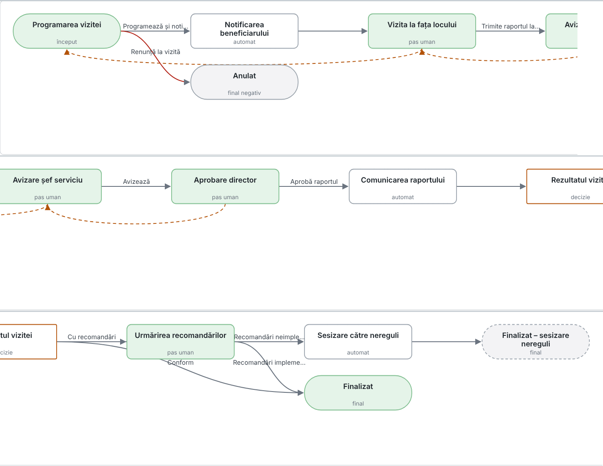<figcaption>Figura 52. Circuitul P8: programare, notificare, vizită, avizare, aprobare, comunicare, apoi încheiere, urmărirea recomandărilor sau sesizare către nereguli. Liniile portocalii întrerupte sunt returnările (inclusiv reprogramarea unei vizite care nu a putut avea loc).</figcaption></figure>

## 10. Tabloul de bord al conducerii

<figure>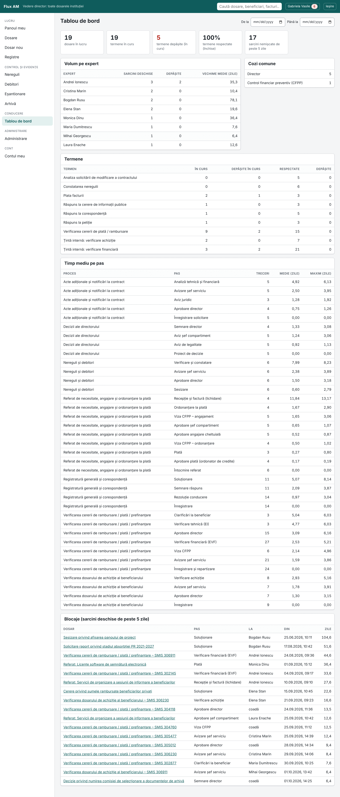<figcaption>Figura 53. Tabloul de bord: dosare și termene în curs, termene depășite, procentul de termene respectate, sarcini nemișcate de peste 5 zile, volumul pe expert, cozile comune, termenele pe tipuri, timpul mediu pe fiecare pas și blocajele.</figcaption></figure>

Directorul, administratorul funcțional și auditorul văd **tot ce au lucrat cei din subordine**:

- cine are câte sarcini și cât de vechi sunt („Volum pe expert”);
- ce termene sunt depășite și la cine;
- cât durează în medie fiecare pas al fiecărui circuit, pentru a găsi blocajele;
- lista dosarelor nemișcate de peste 5 zile, cu link direct.

Din orice dosar, directorul poate deschide istoricul, documentele, semnăturile și jurnalul de audit.

## 11. Administrare

### 10.1. Utilizatori și roluri

<figure>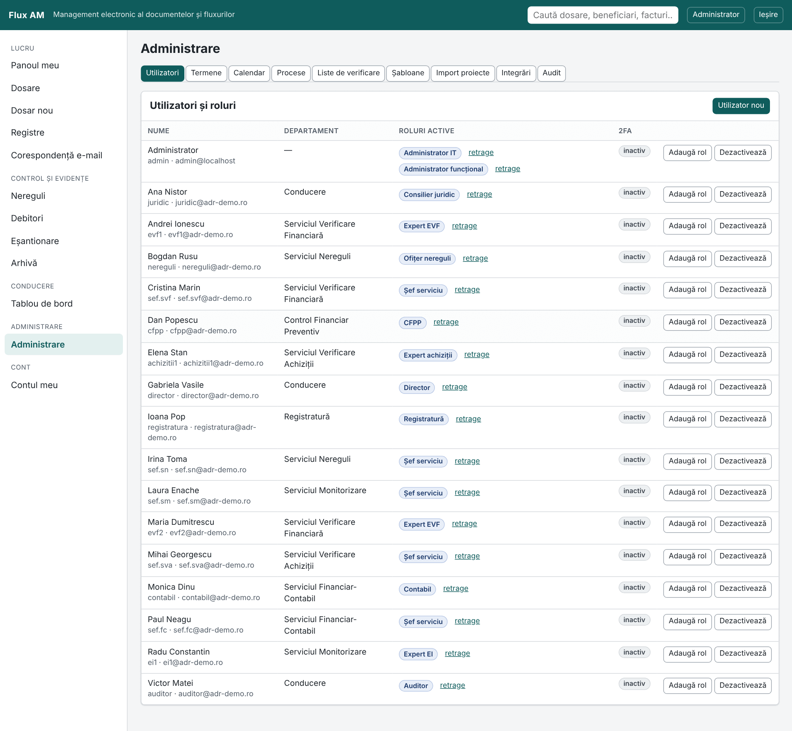<figcaption>Figura 54. Utilizatori și roluri: departament, roluri active (pot fi limitate la un departament sau program și la o perioadă), starea 2FA, adăugarea de roluri și dezactivarea.</figcaption></figure>

### 10.2. Termene și calendar

<figure>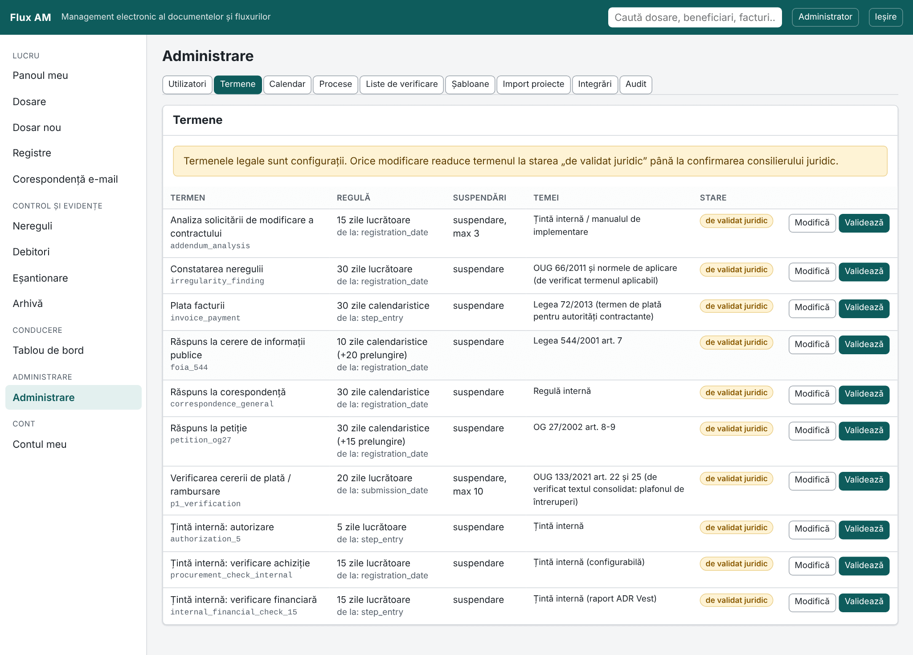<figcaption>Figura 55. Definițiile de termen: durata în zile lucrătoare sau calendaristice, momentul de pornire, regula de suspendare, temeiul legal și starea „de validat juridic”. Orice modificare readuce termenul în această stare până la confirmarea consilierului juridic.</figcaption></figure>

<figure>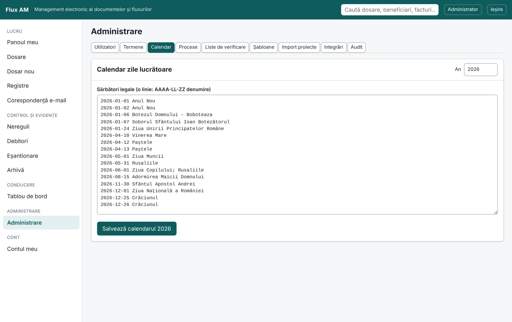<figcaption>Figura 56. Calendarul zilelor lucrătoare: sărbătorile legale ale anului, folosite la calculul tuturor termenelor.</figcaption></figure>

### 10.3. Procese, liste de verificare, șabloane

<figure>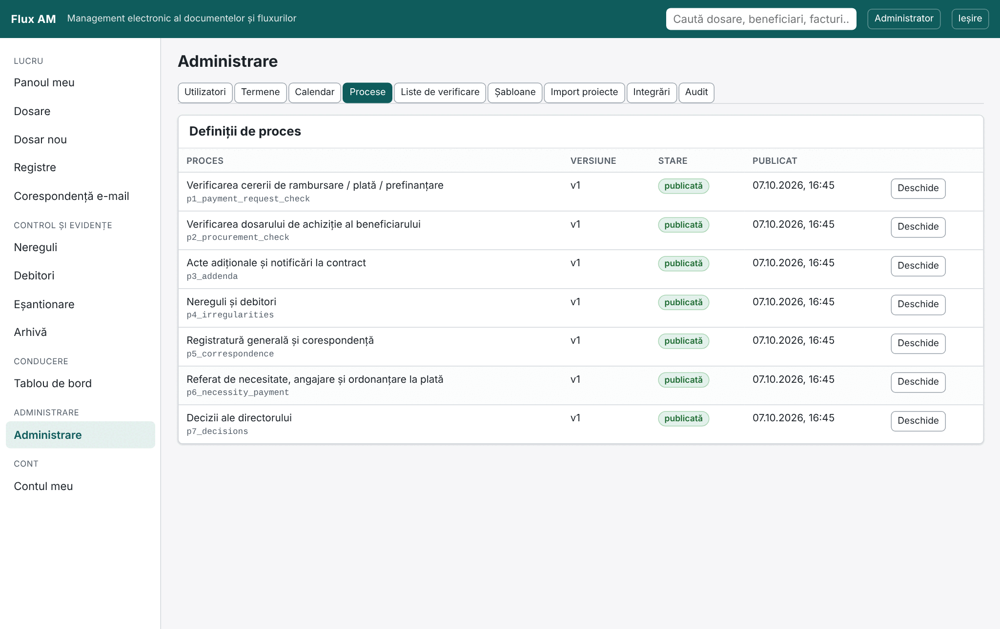<figcaption>Figura 57. Definițiile de proces, versionate. O versiune publicată nu se mai modifică. Dosarele pornite rămân pe versiunea cu care au început. Editorul arată definiția, diagrama și rezultatul validării.</figcaption></figure>

<figure>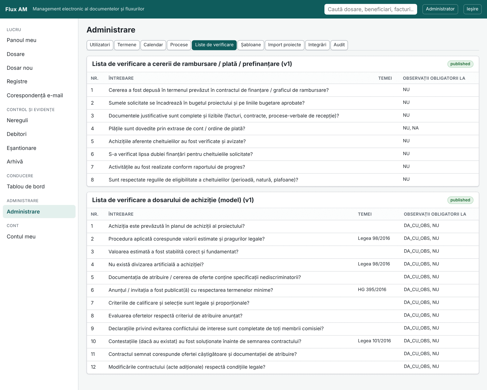<figcaption>Figura 58. Listele de verificare: întrebările, temeiul legal și răspunsurile pentru care observația este obligatorie.</figcaption></figure>

<figure>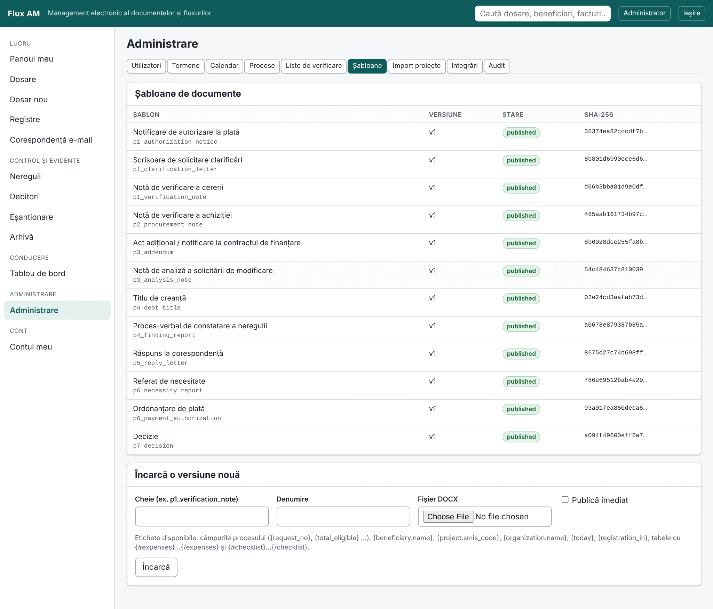<figcaption>Figura 59. Șabloanele de documente (Word), cu versiune și amprentă. O versiune nouă se încarcă direct din pagină, iar etichetele disponibile sunt afișate dedesubt.</figcaption></figure>

### 10.4. Import, integrări, audit

<figure>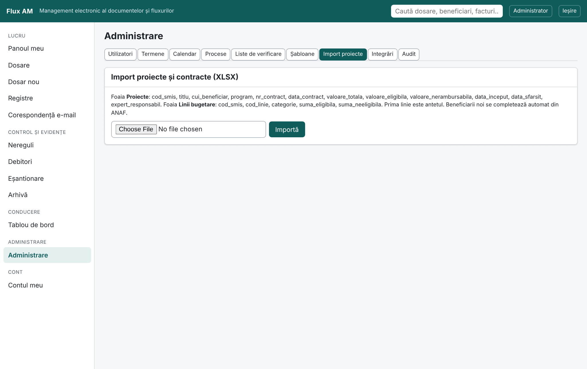<figcaption>Figura 60. Importul proiectelor și contractelor din Excel (foile Proiecte și Linii bugetare). Beneficiarii noi se completează automat din ANAF.</figcaption></figure>

<figure>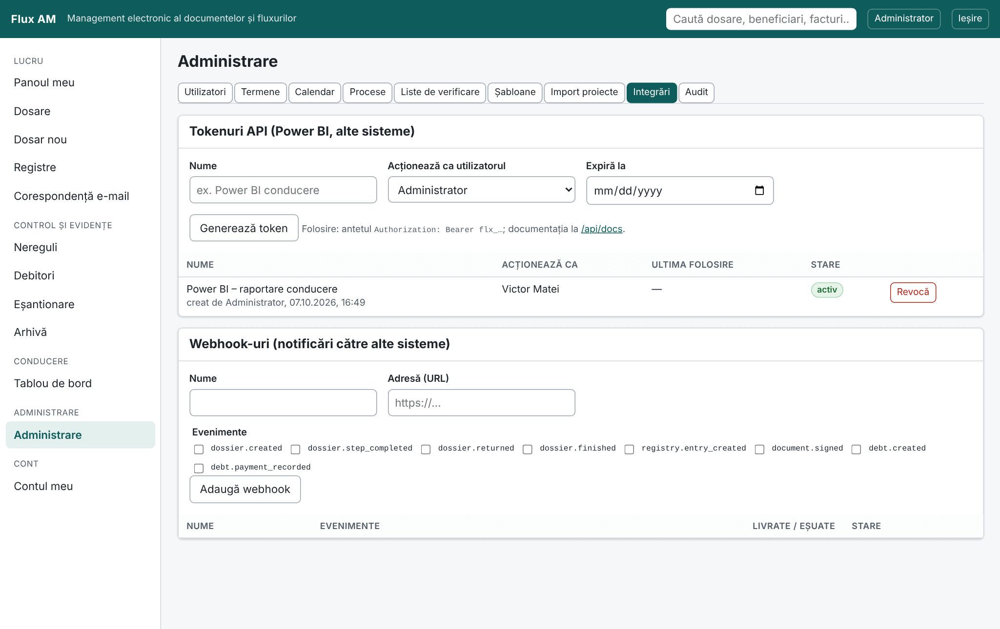<figcaption>Figura 61. Integrări: tokenuri API pentru Power BI sau alte sisteme (aici „Power BI – raportare conducere”, care acționează ca auditorul) și webhook-uri semnate pentru evenimentele principale.</figcaption></figure>

<figure>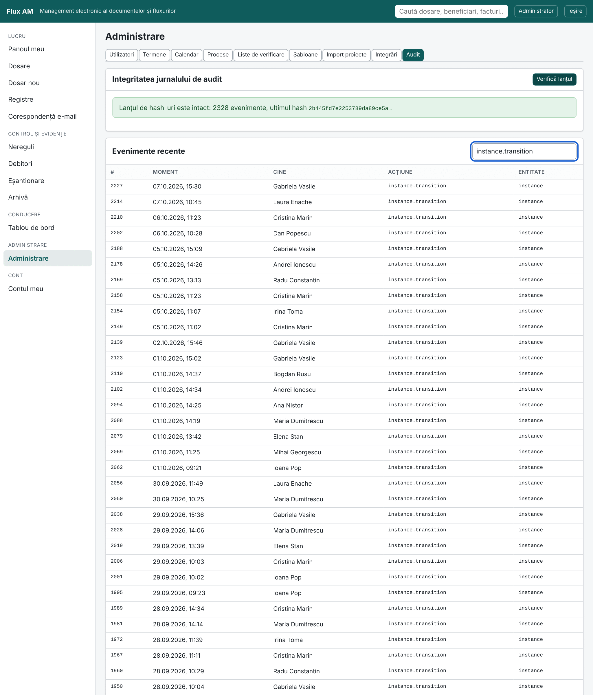<figcaption>Figura 62. Jurnalul de audit global, filtrat după acțiunea „instance.transition”. Butonul „Verifică lanțul” confirmă integritatea: „Lanțul de hash-uri este intact: 2328 evenimente”.</figcaption></figure>

## 12. Contul meu

<figure>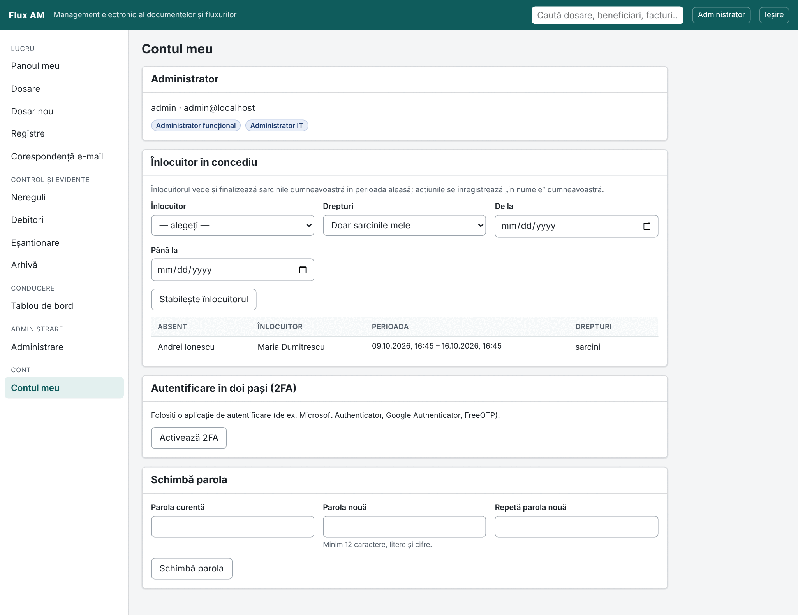<figcaption>Figura 63. Contul meu: înlocuitorul în concediu (perioadă și drepturi, aici Maria Dumitrescu îl înlocuiește pe Andrei Ionescu), activarea autentificării în doi pași și schimbarea parolei.</figcaption></figure>

Înlocuitorul vede și finalizează sarcinile titularului în perioada stabilită. Acțiunile se
înregistrează „în numele” titularului, atât în dosar, cât și în jurnalul de audit.

## 13. Utilizatorii demonstrativi

Parola tuturor: `Demo-parola-2026`.

| Utilizator | Persoană | Rol | Ce să urmăriți |
|---|---|---|---|
| `director` | Gabriela Vasile | Director | toate dosarele, coada de aprobare, semnarea în lot, tabloul de bord |
| `admin` | – | Administrator funcțional și IT | tot ce vede directorul, plus administrarea |
| `auditor` | Victor Matei | Auditor (citire) | toate dosarele și jurnalul de audit |
| `registratura` | Ioana Pop | Inspector registratură | registre, coada de e-mail, dosar nou |
| `evf1`, `evf2` | Andrei Ionescu, Maria Dumitrescu | Expert verificare financiară | sarcini cu termen depășit, clarificări, declarația CI |
| `ei1` | Radu Constantin | Expert monitorizare | verificarea tehnică, acte adiționale, vizitele pe teren (pe telefon) |
| `achizitii1` | Elena Stan | Expert achiziții | verificarea achizițiilor |
| `sef.svf`, `sef.sva`, `sef.sm`, `sef.sn`, `sef.fc` | Cristina Marin, Mihai Georgescu, Laura Enache, Irina Toma, Paul Neagu | Șefi de serviciu | avizări, semnături; `sef.sm` programează vizitele din eșantion |
| `cfpp` | Dan Popescu | CFPP | vizele de control financiar preventiv |
| `juridic` | Ana Nistor | Consilier juridic | avizele de legalitate, validarea termenelor |
| `nereguli` | Bogdan Rusu | Ofițer nereguli | constatări, petiții |
| `contabil` | Monica Dinu | Contabil | ordonanțări, plăți |

Platforma demonstrativă poate fi refăcută oricând în GitHub Codespaces cu
`bash .devcontainer/reset-demo.sh`.
